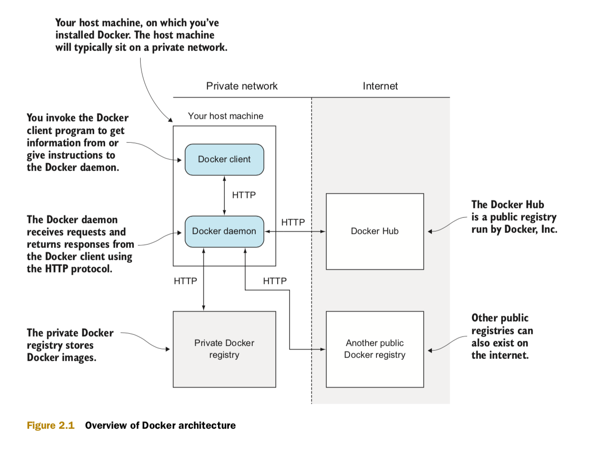
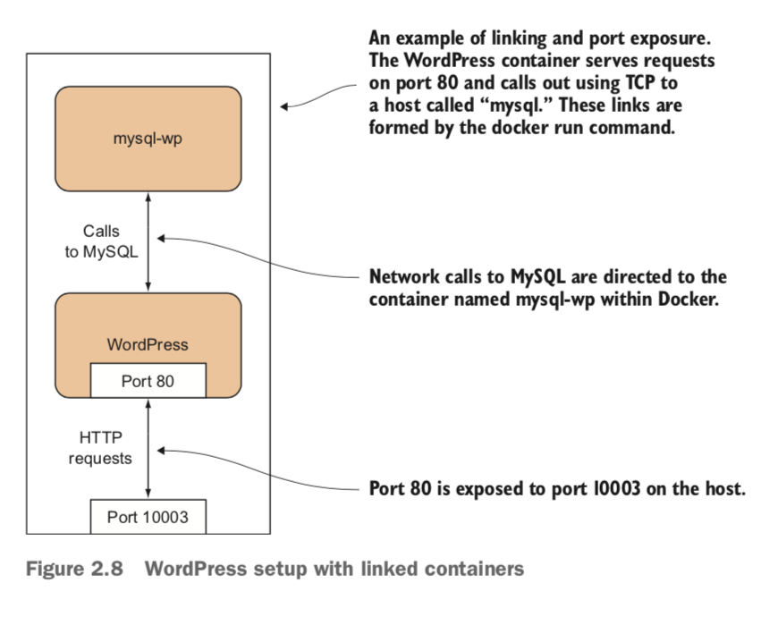
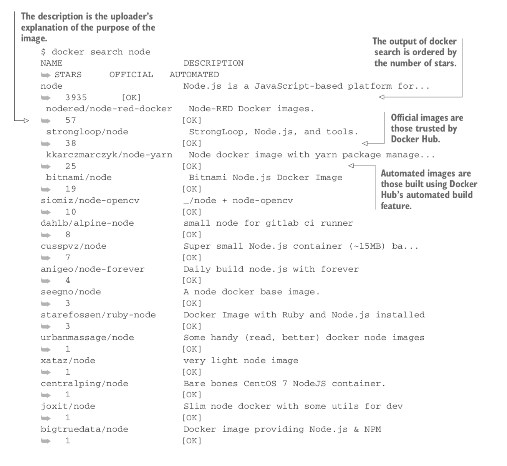

# docker-fundamentals
All-in-One Docker Commands High-Performance Architecture For Production needs.

### - Docker Architecture :

    + Docker on your host machine is (at the time of writing) split into two parts—a dae- mon with a RESTful API and a client that talks to the daemon.
      Figure above shows your host machine running the Docker client and daemon.
      RESTFUL A RESTful API is one that uses standard HTTP request types such as GET, POST, DELETE, and others to perform functions that usually correspond
      to those intended by HTTP’s designers.

      You invoke the Docker client to get information from or give instructions to the daemon; the daemon is a server that receives requests and returns
      responses from the cli- ent using the HTTP protocol. In turn, it will make requests to other services
      to send and receive images, also using the HTTP protocol. The server will accept requests from the command-line client or anyone else authorized to connect.
      The daemon is also responsible for taking care of your images and containers behind the scenes, whereas the client acts as the intermediary between you
      and the RESTful API.

      The private Docker registry is a service that stores Docker images. These can be requested from any Docker daemon that has the relevant access.
      This registry is on an internal network and isn’t publicly accessible, so it’s considered private.
      Your host machine will typically sit on a private network. The Docker daemon will call out to the internet to retrieve images, if requested.
      The Docker Hub is a public registry run by Docker, Inc. Other public registries can also exist on the internet, and your Docker daemon can interact with them.

### - Technique 1:
    + Problem:
      You want to make multiple Docker container services available on a port from your host machine.

    + Solution:
      Use Docker’s -p flag to map a container’s port to your host machine.
      In this example we’re going to use the tutum-wordpress image. Let’s say you want
      to run two of these on your host machine to serve different blogs.
      Because a number of people have wanted to do this before, someone has prepared
      an image that anyone can acquire and start up. To obtain images from external
      loca- tions, you can use the docker pull command. By default,
      images will be downloaded from the Docker Hub:

      1- docker pull tutum/wordpress
      To run the first blog, use the following command:
      2- docker run -d -p 10001:80 --name blog1 tutum/wordpress

      This docker run command runs the container as a daemon (-d) with the publish
      flag (-p). It identifies the host port (10001) to map to the container
      port (80) and gives the container a name to identify it
      (--name blog1 tutum/wordpress).

      You can do the same for the second blog:
      3- docker run -d -p 10002:80 --name blog2 tutum/wordpress

      4- docker ps | grep blog
      5- docker rm -f blog1 blog2 (remove them both)

    `TIP`
    It can be easy to forget which port is the host’s and which port is the container’s
    when using the -p flag. We think of it as being like reading a sentence from left to right.
    The user connects to the host (-p) and that host port is passed to the container port (host_port:container_port).
    It’s also the same format as SSH’s port-forwarding commands, if you’re familiar with them.

### - Technique 2:
    + Problem :
      You want to allow communication between containers for internal purposes.

    + Solution :
      Employ user-defined networks to enable containers to communicate with each other.
      User-defined networks are simple and flexible. We have a couple of WordPress blogs running
      in containers from the previous technique, so let’s take a look at how we can reach them
      from another container (rather than from the outside world, which you’ve seen already).

      First you’ll need to create a user-defined network:
      1- docker network create my_network

      This command creates a new virtual network living on your machine that you can use to manage
      container communication. By default, all containers that you connect to this network will
      be able to see each other by their names.

      Next, assuming that you still have the blog1 and blog2 containers running from the previous
      technique, you can connect one of them to your new network on the fly.
      2- docker network connect my_network blog1

      Checking
      - Finally, you can start up a new container, explicitly specifying the network,
      and see if you can retrieve the first five lines of HTML from the landing page of the blog.

      run ubuntu container and add it to the network (my-network)
      3- docker run -it --network my_network ubuntu:16.04 bash
      -> root@06d6282d32a5:/# (you are coonected to ubuntu container)
      4- apt update && apt install -y curl
      5- curl -sSL blog1 | head -n5

      `TIP`
       TIP Giving containers names is very useful for assigning memorable hostnames you can later refer to,
       but it’s not strictly necessary—if connections are only outgoing, then you probably won’t need to look up the container.
       If you find you do want to look up the host and haven’t assigned a name, you can resort to using the short image ID
       as listed in the terminal prompt (unless it has been overridden with a hostname) or in the docker ps output.

       `DISCUSSION`
       You can use this technique to set up any number of containers in a cluster on their own private network,
       only requiring that the containers have some way of discovering each other’s names.
       In technique 80 you’ll see a method of doing this that integrates well with Docker networks.
       Meanwhile, the next technique will start much smaller, demonstrating some benefits of being able
       to make an explicit connection between a single container and the service it provides.
       One additional point of note is the interesting final state of the blog1 container.
       All containers are connected to the Docker bridge network by default,
       so when we asked for it to join my_network, it did so in addition to the network it was already on

### - Technique 3:
       In the previous technique you saw how to get containers to communicate with user- defined networks. But there’s an older method of declaring container communication— Docker’s link flag. This isn’t the recommended way of working anymore, but it has been part of Docker for a long time, and it’s worth being aware of in case you encounter it in the wild.
       + PROBLEM :
         You want to allow communication between containers without using user-defined networks.

       + SOLUTION :
         Use Docker’s linking functionality to allow the containers to communicate with each other.
         Taking up the torch of the WordPress example, we’re going to separate the MySQL database tier
         from the WordPress container, and link these to each other without port
         configuration or creating a network. Figure below gives an overview of the final state.

        ++ NOTE Why bother with linking if you can already expose ports to the host and use that?
           Linking allows you to encapsulate and define the relationships between containers without exposing services
           to the host’s network (and potentially, to the outside world). You might want to do this for security reasons, for example.

        1- docker run --name wp-mysql -e MYSQL_ROOT_PASSWORD=yoursecretpassword -d mysql
        2- docker logs wp-mysql (check if mysql container ready to receive connections)
        3- docker run --name wordpress --link wp-mysql:mysql -p 10003:80 -d  wordpress

        4- http://localhost:10002 (check in the browser (if you don't know the port of wordpress run docker ps))

        + By splitting your workload into separate containers, you’ve taken a step toward creating
          a microservices architecture for your application. In this case you could perform work on the MySQL
          container while leaving the WordPress container untouched, or vice versa. This fine-grained control
          over running services is one of the key opera- tional benefits of a microservices architecture.

### - Technique 4:
    - Setting up a local Docker registry
    + PROBLEM :
      You want a way to host your images locally.
    + SOLUTION
      Set up a registry server on your local network. Simply issue the following command on a machine with plenty of disk space:
      1- docker run -d -p 5000:5000 -v $HOME/registry:/var/lib/registry registry:2

      - This command makes the registry available on port 5000 of the Docker host
        (-p 5000:5000). With the -v flag, it makes the registry folder on your host
        (/var/lib/registry) available in the container as $HOME/registry.
        The registry’s files will therefore be stored on the host in the /var/lib/registry folder.

      - On all of the machines that you want to access this registry, add the following to your daemon options
        (where HOSTNAME is the hostname or IP address of your new reg- istry server):
        --insecure-registry HOSTNAME (see appendix B for details on how to do this).
        You can now issue the following command: docker push HOSTNAME:5000/ image:tag.

      `TIP`
       As you can see, the most basic level of configuration for a local registry, with all data stored
       in the $HOME/registry directory, is simple. If you wanted to scale up or make it more robust,
       the repository on GitHub (https://github.com/docker/distribution/ blob/v2.2.1/docs/storagedrivers.md)
       outlines some options, like storing data in Amazon S3.

### - Technique 5:
    PROBLEM :
    You want to find an application or tool as a Docker image and try it out.
    SOLUTION :
    Use the docker search command to find the image to pull, and then run it.

    Let’s say you’re interested in playing with Node.js. In the following example we
    searched for images matching “node” with the docker search command:

    1- docker search node
    2- docker pull node (download docker image with name node)

