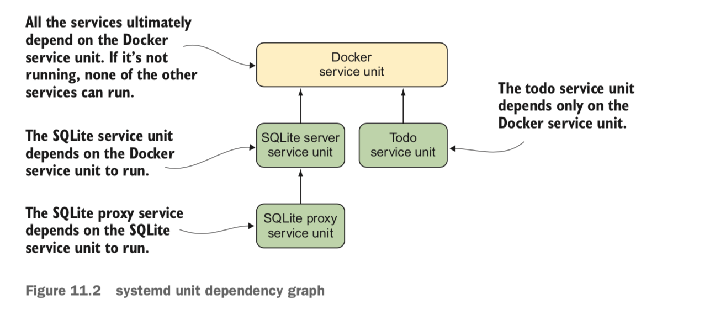
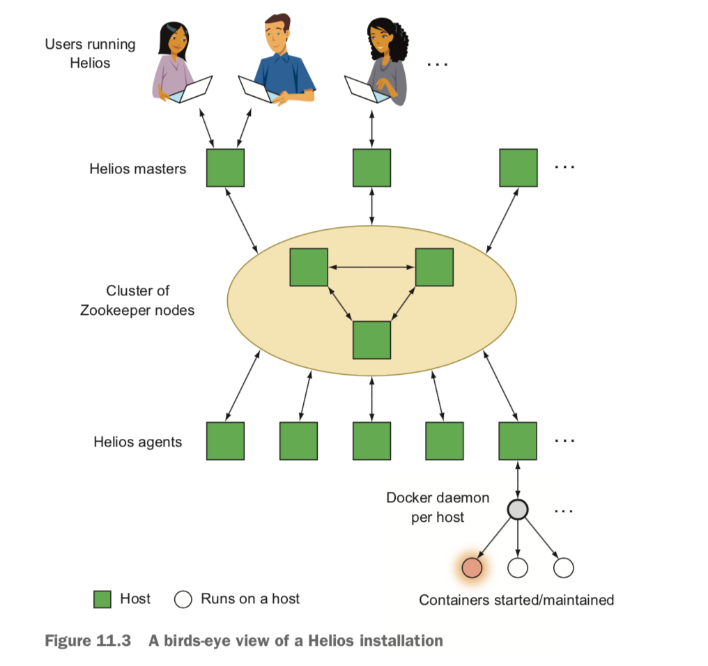
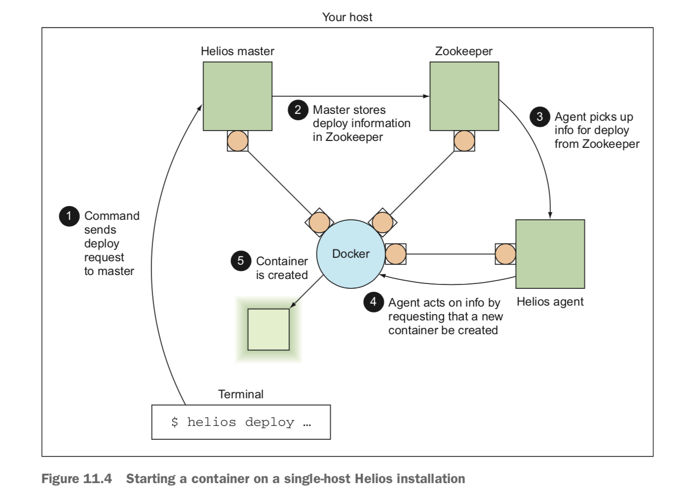
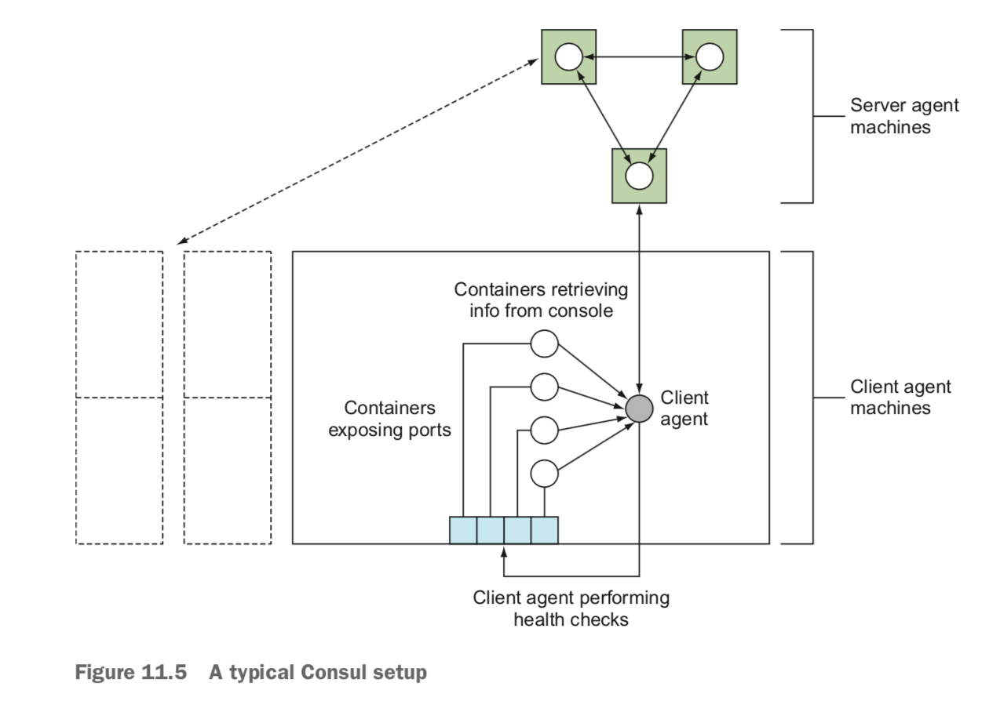

### + Containers Management

### - Technique 1 - Managing your host’s containers with systemd :

    + PROBLEM :
    You want to manage the running of Docker container services on your host.

    + SOLUTION :
    Use systemd to manage your container services.
    systemd is a system-management daemon that replaced SysV init scripts in Fedora some time ago. It manages services on your system—everything from mount points to processes to one-shot scripts—as individual “units.”

    + install systemd or use vagrant VM

    # Vagrant VM
    1- mkdir centos7_docker/
    2- cd centos7_docker/
    3- vagrant init williamyeh/centos7-docker
    4- vagrant up
    5- vagrant ssh

    $ sudo su -
    $ systemctl status
    $ cd /etc/systemd/system/

    #todo.service
        [Unit]
        Description=Simple ToDo Application
        After=docker.service
        Requires=docker.service
        [Service]
        TimeoutStartSec=1200
        Restart=always
        ExecStartPre=/bin/bash \
        -c '/usr/bin/docker rm -f todo || /bin/true'
        ExecStartPre=/usr/bin/docker pull mdrahali/todo_app
        ExecStart=/usr/bin/docker run --name todo \
        -p 8000:8000 mdrahali/todo_app
        ExecStop=/usr/bin/docker rm -f todo
        [Install]
        WantedBy=multi-user.target

    NOTE
    Docker doesn’t set any container restart policies by default,
    but be aware that any you set will conflict with most process managers.
    Don’t set restart policies if you’re using a process manager.

    $ check password for root ->  cat /etc/group | grep root
    $ systemctl enable /etc/systemd/system/todo.service

    $ systemctl start todo.service
    $ systemctl status todo.service

### - Technique 2 :

    NOTE
    If you run into trouble with this technique, you may need to upgrade your version of Docker.
    Version 1.7.0 or greater should work fine.

    + PROBLEM :
    You want to manage more complex container orchestration on one host in production.

    + SOLUTION :
    Use systemd with dependent services to manage your containers.

    A key difference here is that rather than the SQLite service being treated as a single monolithic entity, each container is a discrete entity. In this sce- nario, the SQLite proxy can be stopped independently of the SQLite server.

    $ touch /etc/systemd/system/sqliteserver.service

    [Unit]
    Description=SQLite Docker Server
    After=docker.service
    Requires=docker.service
    [Service]
    TimeoutStartSec=1200
    Restart=always
    ExecStartPre=-/bin/touch /tmp/sqlitedbs/test
    ExecStartPre=-/bin/touch /tmp/sqlitedbs/live
    ExecStartPre=/bin/bash \
    -c '/usr/bin/docker kill sqliteserver || /bin/true'
    ExecStartPre=/bin/bash \
    -c '/usr/bin/docker rm -f sqliteserver || /bin/true'
    ExecStartPre=/usr/bin/docker \
    pull dockerinpractice/docker-compose-sqlite
    ExecStart=/usr/bin/docker run --name sqliteserver \
    -v /tmp/sqlitedbs/test:/opt/sqlite/db \
    dockerinpractice/docker-compose-sqlite /bin/bash -c \
    'socat TCP-L:12345,fork,reuseaddr \
    EXEC:"sqlite3 /opt/sqlite/db",pty'
    ExecStop=/usr/bin/docker rm -f sqliteserver

    [Install]
    WantedBy=multi-user.target

    $ touch /etc/systemd/system/sqliteproxy.service

    [Unit]
    Description=SQLite Docker Proxy
    After=sqliteserver.service
    Requires=sqliteserver.service
    [Service]
    TimeoutStartSec=1200
    Restart=always
    ExecStartPre=/bin/bash -c '/usr/bin/docker kill sqliteproxy || /bin/true'
    ExecStartPre=/bin/bash -c '/usr/bin/docker rm -f sqliteproxy || /bin/true'
    ExecStartPre=/usr/bin/docker pull dockerinpractice/docker-compose-sqlite
    ExecStart=/usr/bin/docker run --name sqliteproxy \
    -p 12346:12346 --link sqliteserver:sqliteserver  dockerinpractice/docker-compose-sqlite /bin/bash \
    -c 'socat TCP-L:12346,fork,reuseaddr TCP:sqliteserver:12345'
    ExecStop=/usr/bin/docker rm -f sqliteproxy

    [Install]
    WantedBy=multi-user.target

    $ sudo systemctl enable /etc/systemd/system/sqliteserver.service
    $ sudo systemctl enable /etc/systemd/system/sqliteproxy.service

    # Startup

    #Disable Docker (docker-main.repo) and enable CentOS (CentOS-Base.repo)
    - /etc/yum.repos.d
    - vi docker-main.repo -> change enable=1 to 0
    - vi CentOS-Base.repo -> change enable=0 to 1
    - yum -y install telnet

    [NOTE] -> (https://forums.centos.org/viewtopic.php?t=61460)
    After installing you should get back docker to 1 and CentOS to 0.

    systemctl start telnet.socket
    systemctl enable telnet.socket
    iptables -I INPUT -p tcp --dport 12346 -j ACCEPT
    systemctl daemon-reload

    - sudo systemctl start sqliteproxy.service
    - netstat -tapnl | grep 443
        tcp        0      0 10.0.2.15:46800         `104.18.124.25`:443       ESTABLISHED 896/dockerd
    - telnet 104.18.124.25 12346

### - Technique 3 - Manual multi-host Docker with Helios

    + PROBLEM :
    You want to be able to provision multiple Docker hosts with containers but retain manual control over what runs where.

    + SOLUTION :
    Use the Helios tool from Spotify to precisely manage containers on other hosts.
    Helios is the tool Spotify currently uses to manage their servers in production,
    and it has the pleasing property of being both easy to get started with and stable
    (as you’d hope). Helios allows you to manage the deployment of Docker containers across multiple hosts.
    It gives you a single command-line interface that you can use to specify what you want to run and where to run it,
    as well as the ability to take a look at the cur- rent state of play.

    As you can see, there’s only one additional service required when running Helios: Zookeeper.
    Helios uses Zookeeper to track the state of all of your hosts and as a communication channel between the masters and agents.

    TIP
    Zookeeper is a lightweight distributed database written in Java that’s optimized for storing configuration information.
    It’s part of the Apache suite of open source software products. It’s similar in functionality to etcd.

    $ docker run --name zookeeper -d jplock/zookeeper:3.4.6
    $ docker inspect -f '{{.NetworkSettings.IPAddress}}' zookeeper

    NOTE
    When starting a Zookeeper instance on its own node, you’ll want to expose ports to make it
    accessible to other hosts and use volumes to persist data. Take a look at the Dockerfile
    on the Docker Hub for details about which ports and folders you should use
    https://hub.docker.com/r/jplock/zookeeper/dockerfile/

    + You can inspect the data Zookeeper has stored by using the zkCli.sh tool,

    $ docker exec -it zookeeper bin/zkCli.sh -> enter
    $ ls /

    + Nothing’s running against Zookeeper yet, so the only thing currently being stored
      is some internal Zookeeper information. Leave this prompt open, and we’ll revisit it as we progress.

    + Helios itself is split into three parts:
    - The master—This is used as an interface for making changes in Zookeeper.
    - The agent—This runs on every Docker host, starts and stops containers based on
    Zookeeper, and reports state back.
    - The command-line tools—These are used to make requests to the master.

    -- We need to run the master while specifying the IP address of the Zookeeper node we started earlier.
    1- IMG=dockerinpractice/docker-helios
    2- docker run -d --name hmaster $IMG helios-master --zk 172.17.0.2
    3- docker logs --tail=3 hmaster
    4- docker inspect -f '{{.NetworkSettings.IPAddress}}' hmaster

    # Now let’s see what’s new in Zookeeper:

    $ ls /
    $ ls /status/masters
    $ ls /status/hosts

    -- Unfortunately we don’t have any hosts yet.
       Let’s solve this by starting up an agent that will use the current
       host’s Docker socket to start containers on:

    $ docker run -v /var/run/docker.sock:/var/run/docker.sock -d --name hagent \
      dockerinpractice/docker-helios helios-agent --zk 172.17.0.2

    $ docker logs --tail=3 hagent
    $ docker inspect -f '{{.NetworkSettings.IPAddress}}' hagent

    master 172.17.0.3
    host 172.17.0.4

    # Now let’s see what’s new in Zookeeper Again:
    $ ls /status/hosts
    $ ls /status/hosts/ae45a8e70086
    $ get /status/hosts/ae45a8e70086/agentinfo

    NOTE
    When running on multiple hosts, you’ll want to pass --name $(host- name -f)
    as an argument to both the Helios master and agent. You’ll also need to expose ports
    5801 and 5802 for the master and 5803 and 5804 for the agent.

    master -> IP 172.17.0.3
    Note - 5801 (master port)
    + that the command-line interface needs to be pointed at the Helios master rather than Zookeeper.

    $ alias helios="docker run -i --rm dockerinpractice/docker-helios \
      helios -z http://172.17.0.3:5801"

    $ helios create -p nc=8080:8080 netcat:v1 ubuntu:14.04.2 -- \
      sh -c 'echo hello | nc -l 8080'

    $ helios jobs

    -- You can use helios hosts to list hosts available for job deployment,
       and then actu- ally perform the deployment with helios deploy.
       The helios status command then shows us that the job has successfully started:

    $ helios hosts
    $ helios deploy netcat:v1 ae45a8e70086
    $ helios status

    -- Of course, we now want to verify that the service works:
    $ curl localhost:8080
    $ helios status

    -- clearup
    $ helios undeploy -a --yes netcat:v1
    $ helios remove --yes netcat:v1

    ++ this simplicity comes at a cost once you move to more advanced deployment
       scenarios—features like resource limits, dynamic scaling,
       and so on are currently miss- ing, so you may find yourself reinventing parts of tools like Kubernetes

### - Technique 4 - Using Consul to discover services

    + etcd is a highly popular tool, but it does have one particular competitor
      that gets men- tioned alongside it a lot: Consul. This is a little strange,
      because there are other tools more similar to etcd
      (Zookeeper has a similar feature set to etcd but is implemented in a different language),
      whereas Consul differentiates itself with some interesting additional features,
      like service discovery and health checks. In fact,
      if you squint, Consul might look a bit like etcd, SkyDNS, and Nagios all in one.

    + PROBLEM :
    You need to be able to distribute information to, discover services within, and monitor
    a collection of containers.

    + SOLUTION :
    Start a container with Consul on each Docker host to provide a service directory and configuration communication system.

    + Consul provides the following:
    - Service configuration—A key/value store for storing and sharing small values, like etcd and Zookeeper
    - Service discovery—An API for registering services and a DNS endpoint for discov- ering them, like SkyDNS
    - Service monitoring—An API for registering health checks, like Nagios

    ++  In short, if you lose under half of your server agents,
        you’re guaranteed to be able to recover your data
        Because these servers are so important and have greater resource requirements,
        keeping them on dedicated machines is a typical choice.

    NOTE
    Although the commands in this technique will leave the Consul data directory
    (/data) inside the container, it’s generally a good idea to specify
    this directory as a volume for at least the servers, so you can keep backups.

    - It’s recommended that all machines under your control that may want to interact
      with Consul should run a client agent.
      These agents forward requests on to the servers and run health checks.

    $ IMG=gliderlabs/consul-server:0.6
    $ docker pull $IMG
    $ ip addr | grep 'inet ' | grep -v 'lo$\|docker0$\|vbox.*$'
       or ifconfig | grep inet

    - inet 192.168.1.5

    $ export EXTIP1=10.0.2.15
    $ echo '{"ports": {"dns": 53}}' > dns.json

    $ docker run -d --name consul --net host \
      -v $(pwd)/dns.json:/config/dns.json $IMG -bind $EXTIP1 -client $EXTIP1 \
      -recursor 8.8.8.8 -recursor 8.8.4.4 -bootstrap-expect 1

    $ docker logs consul

    NOTE
    The IP address 0.0.0.0 is typically used to indicate that an application should
    listen on all available interfaces on the machine. We’ve deliberately not done this,
    because some Linux distributions have a DNS-caching daemon listening on 127.0.0.1,
    which disallows listening on 0.0.0.0:53.

    There are three items of note in the preceding docker run command:
    1- We’ve used --net host. Although this can be seen as a faux pas in the Docker world,
       the alternative is to expose up to eight ports on the command line—it’s
       a matter of personal preference, but we feel it’s justified here.
       It also helps bypass a potential issue with UDP communication.
       If you were to go the manual route, there’d be no need to set
       the DNS port—you could expose the default Consul DNS port (8600)
       as port 53 on the host.
    2- The two recursor arguments tell Consul what DNS servers to look at if a requested address
       is unknown by Consul itself.

    3- The -bootstrap-expect 1 argument means the Consul cluster will start operating with only one agent,
       which is not robust. A typical setup would set this to 3 (or more) to make sure the cluster
       doesn’t start until the required number of servers has joined. To start the additional server agents,
       add a -join argument, as we’ll discuss when we start a client.

    WARNING
    Because Consul expects to be able to listen on a particular set of ports when communicating with other agents,
    it’s tricky to set up multiple agents on a single machine while still demonstrating how it would work in the real world.
    We’ll use a different host now—if you decide to use an IP alias, ensure you pass a -node newAgent,
    because by default the hostname will be used, which will conflict.

    + Now let’s go to a second machine, start a client agent, and add it to our cluster:

    #Setup Consul Agent in a diffrent host :

    $ IMG=gliderlabs/consul-agent:0.6
    $ docker pull $IMG
    $ EXTIP1=10.0.2.15
    $ ip addr | grep docker0 | grep inet
    $ BRIDGEIP=172.17.0.1
    $ ip addr | grep 'inet ' | grep -v 'lo$\|docker0$'
    $ EXTIP2=10.0.2.15
    $ echo '{"ports": {"dns": 53}}' > dns.json
    $ docker run -d --name consul-client --net host \
      -v $(pwd)/dns.json:/config/dns.json $IMG -client $BRIDGEIP -bind $EXTIP2 \
      -join $EXTIP1 -recursor 8.8.8.8 -recursor 8.8.4.4

    $ docker logs consul-client

    NOTE
    The images we’ve used are based on gliderlabs/consul-server:0.5 and gliderlabs/consul-agent:0.5,
    and they come with a newer version of Consul to avoid possible problems with UDP communication,
    indicated by the constant logging of lines like “Refuting a suspect message.”
    When version 0.6 of the images is released, you can switch back to the images from gliderlabs.

    https://hub.docker.com/u/gliderlabs

    $ curl -sSL $BRIDGEIP:8500/v1/agent/members | tr ',' '\n' | grep Name
        [{"Name":"mylaptop2"
        {"Name":"mylaptop"

    $ docker run -d --name files -p 8000:80 ubuntu:14.04.2 \
        python3 -m http.server 80
    $ docker inspect -f '{{.NetworkSettings.IPAddress}}' files
    $ /bin/echo -e 'GET / HTTP/1.0\r\n\r\n' | nc -i1 172.17.0.16 80 \
      | head -n 1
    $ curl -X PUT --data-binary '{"Name": "files", "Port": 8000}' \
      $BRIDGEIP:8500/v1/agent/service/register

    $ docker logs consul-client | tail -n 1
    [......]

### - Technique 5 - Docker cluster with Swarm mode:

    Swarm mode for Docker is the official solution from Docker Inc. to treat a cluster of hosts as a single Docker daemon
    and deploy services to them.
    A Docker swarm consists of a number of nodes. Each node may be a manager or a worker, and these roles are flexible
    and can be changed in the swarm at any time. A manager coordinates the deployment of services to available nodes,
    whereas workers will only run containers. By default, managers are available to run containers as well,
    but you’ll see how to alter that as well.
    When the manager is started, it initializes some state for the swarm and then listens for incoming connections
    from additional nodes to add to the swarm.

    # Host 1:

    $ ip addr show | grep 'inet ' | grep -v 'lo$\|docker0$'
       or  ifconfig | grep inet

    $ docker swarm init --advertise-addr 172.18.0.1

    + This has created a new swarm and set up the Docker daemon of the host h1 to be a manager.

    $ docker info # check swarm created
    $ docker node ls

    # Host 2

    - To add a worker to this swarm, run the following command:

    $ docker swarm join \
    --token SWMTKN-1-3t0hv6mpkzue06twnse9k7nhdq8iu8zx36l7rlw9fvhfqt2jkj-76nlkt0zv1x0krex7vrzbuj8z \
    10.0.2.15:2377

    # Host 1

    $ docker node ls # check manager and worker

    + we’ll mark the manager as having availability drain—by default, all managers are available to run containers,
      but in this technique we want to demonstrate remote machine scheduling capabilities,
      so we’ll constrain things to avoid the manager. Drain will cause any containers already
      on the node to be redeployed elsewhere, and no new services will be scheduled on the node.

    # Host 1

    $ docker node update --availability drain i5vtd3romfl9jg9g4bxtg0kis
    $ docker service create --name server -d -p 8000:8000 ubuntu:14.04 \
        python3 -m http.server 8000
    $ docker service ls

    - There are a few things to note here. The most important is that the swarm has
      auto- matically selected a machine to start the container on—if you had multiple workers,
      the manager would choose one based on load balancing. You probably also recognize some of the arguments to docker
      service create as familiar from docker run—a number of arguments are shared,

    $ docker service ps server
    $ docker node inspect --pretty h2 | grep Addr

    # Host 2

    $ curl -sSL 192.168.11.50:8000 | head -n4

    ++ Swarm mode has a piece of additional functionality it enables by default, called the routing mesh.
       This allows each node in the swarm to appear as if it can serve requests for all services within
       the swarm that have published ports—any incoming connec- tions are forwarded to an appropriate node.

    For example, if you go back on the h1 manager node again (which we know isn’t running the service, because it has availability drain), it will still respond on port 8000 to any requests:

    host 1
    $ curl -sSL localhost:8000 | head -n4

    # Shutdown services

    $ docker service rm server
    $ docker swarm leave

### - Technique 5 - Using OpenShift to run AWS APIs locally :

    One of the big challenges with local development is testing an application against other services.
    Docker can help with this if the service can be put in a container, but this leaves the large world
    of external third-party services unsolved.
    A common solution is to have test API instances, but these often provide fake responses—a more
    complete test of functionality isn’t possible if an application is built around a service.
    For example, imagine you want to use AWS S3 as an upload location for your application,
    where it then processes the uploads—testing this will cost money.

    - PROBLEM
    You want to have AWS-like APIs available locally to develop against.

    - SOLUTION
    Set up LocalStack and use the available AWS service equivalents.
    In this walkthrough you’re going to set up an OpenShift system using Minishift,
    and then run LocalStack in a pod on it. OpenShift is a RedHat-sponsored wrapper around Kubernetes
    that provides extra functionality more suited to enterprise pro- duction deployments of Kubernetes.

    In this technique we’ll cover :

    1- The creation of routes in OpenShift
    2- Security context constraints
    3- Differences between OpenShift and Kubernetes  Testing AWS services using public Docker images

    ++ LOCALSTACK
    LocalStack is a project that aims to give you as complete as possible a set of AWS APIs to develop against without incurring any cost. This is great for testing or trying code out before running it for real against AWS and potentially wasting time and money.
    LocalStack spins up the following core Cloud APIs on your local machine:
    1- API Gateway at http://localhost:4567
    2- Kinesis at http://localhost:4568
    3- DynamoDB at http://localhost:4569
    4- DynamoDB Streams at http://localhost:4570
    5- Elasticsearch at http://localhost:4571
    6- S3 at http://localhost:4572
    7- Firehose at http://localhost:4573
    8- Lambda at http://localhost:4574
    9- SNS at http://localhost:4575
    10- SQS at http://localhost:4576
    11- Redshift at http://localhost:4577
    12- ES (Elasticsearch Service) at http://localhost:4578
    13- SES at http://localhost:4579
    14- Route53 at http://localhost:4580
    15- CloudFormation at http://localhost:4581
    16- CloudWatch at http://localhost:4582

    - LocalStack supports running in a Docker container, or natively on a machine.
      It’s built on Moto, which is a mocking framework in turn built on Boto,
      which is a Python AWS SDK.

    # Clean Install OpenShift
    All you need to install are

    # install hyperkit
    $ brew reinstall hyperkit
    # install docker driver for hyperkit
    $ brew install docker-machine-driver-hyperkit
    # install minishift
    $ brew cask install minishift
    # force update minishift
    $ brew cask install --force minishift

    1. Docker Desktop
    2. Minishift (download from okd.io)
    3. OC cli tool (download from okd.io)

    $ mkdir openshift
    $ put oc and kublect
    $ alias oc='/Users/MDRAHALI/OpenShift/oc'
    $ alias kubectl='/Users/mdrahali/OpenShift/kubectl'
    and follow up these steps in terminal

    # start minishift
    $ sudo chown root:wheel /usr/local/bin/docker-machine-driver-hyperkit && sudo chmod u+s /usr/local/bin/docker-machine-driver-hyperkit

    Solved here using:
    $ minishift delete --force
    $ rm -rf ~/.minishift
    $ minishift start --vm-driver hyperkit

    check https://192.168.64.4:8443/console
    You are logged in as:
        User:     developer
        Password: <any value>

    To login as administrator:
        oc login -u system:admin

    - Problem :

    + Could not set oc CLI context for 'minishift' profile:
      Error during setting 'minishift' as active profile:
      The specified path to the kube config '/Users/mdrahali/.minishift/machines/minishift_kubeconfig'
      does not exist

    # check that minishift is installed
    $ eval $(minishift oc-env)
    $ oc get all
    $ oc login -u system:admin
    $ oc edit scc restricted

        You’ll see the definition of the restricted SCC.
            At this point you’re going to have to do two things:
            - Allow containers to run as any user (in this case root)
            - Prevent the SCC from restricting your capabilities to setuid and setgid

        ALLOWING RUNASANY
        The LocalStack container runs as root by default, but for security reasons, OpenShift doesn’t allow containers to run as root by default. Instead it picks a UID within a very high range, and runs as that UID. Note that UIDs are numbers, as opposed to user- names, which are strings mapped to a UID.
        To simplify matters, and to allow the LocalStack container to run as root, change these lines,
        runAsUser:
            type: MustRunAsRange
        to read as follows:
        runAsUser:
            type: RunAsAny

    + This allows containers to run as any user, and not within a range of UIDs.

    ALLOWING SETUID AND SETGID CAPABILITIES
    When LocalStack starts up, it needs to become another user to start ElastiCache. The ElastiCache service doesn’t start up as the root user.
    To get around this, LocalStack su’s the startup command to the LocalStack user in the container. Because the restricted SCC explicitly disallows actions that change your user or group ID, you need to remove these restrictions. Do this by deleting these lines:
    - SETUID
    - SETGID

    # Make a note of the host
    $ minishift console --machine-readable | grep HOST | sed 's/^HOST=\(.*\)/\1/'

    DEPLOYING THE POD
    Deploying the LocalStack is as easy as running this command:
    $ oc new-app localstack/localstack --name="localstack"

    NOTE
    If you want to take a deeper look at the localstack image, it’s available at
    https://github.com/localstack/localstack.
    This takes the localstack/localstack image and creates an OpenShift application around
    it for you, setting up internal services (based on the exposed ports in the LocalStack
    Docker image’s Dockerfile), running the container in a pod, and perform- ing various other management tasks.

    CREATING THE ROUTES
    If you want to access the services from outside, you need to create OpenShift routes,
    which create an external address for accessing services within the OpenShift network.
    For example, to create a route for the SQS service,
    create a file like the following, called route.yaml:

    # Create the route by running this command,

    $ oc create -f route.yaml
        # to delete a route
        $  oc delete route/<name>

    #describe a route
    $ oc describe route/sqs
    $ oc get all
    $ aws --endpoint-url=http://sqs.192.168.64.2.io sqs

