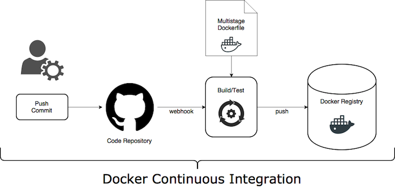
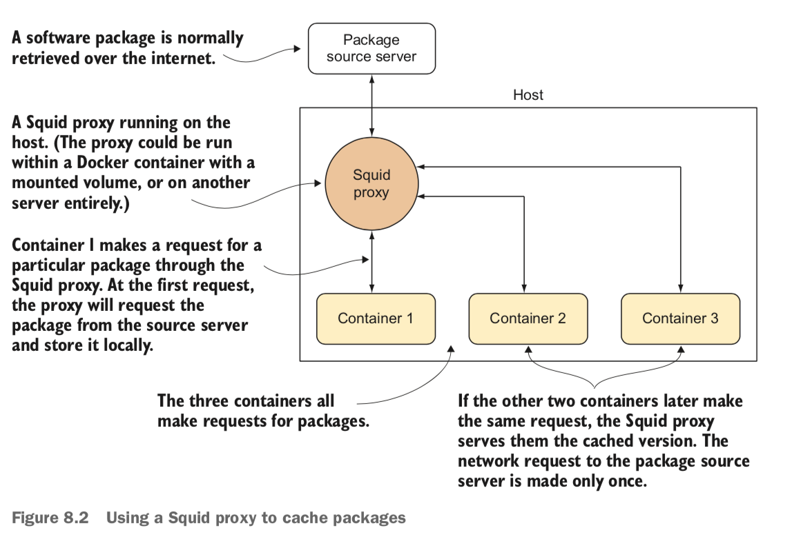
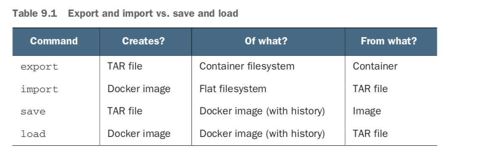
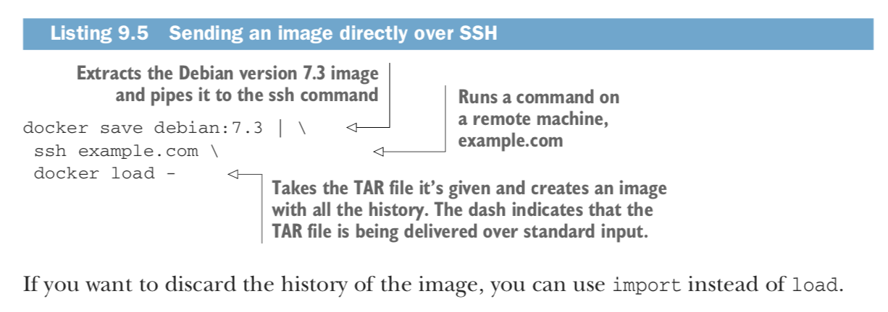
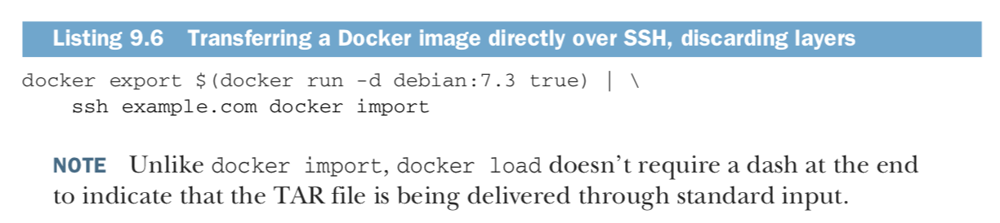
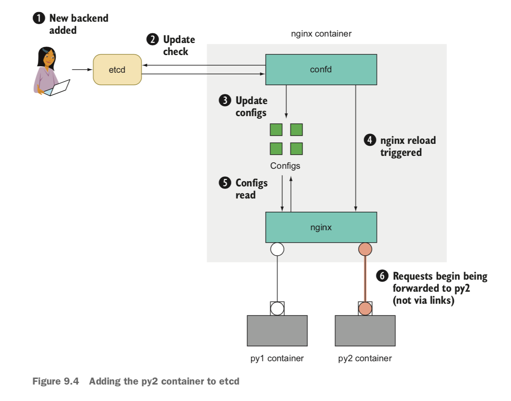

### - Continuous Integration :
      :NOTE
       In case you don’t know, continuous integration is a software lifecycle strategy used to speed up
       the development pipeline. By automatically rerun- ning tests every time a significant
       change is made to the codebase, you get faster and more stable deliveries because there’s
       a base level of stability in the software being delivered.

       + Docker Hub automated builds :
         --> The Docker Hub automated build feature :
         - if you point to a Git repository containing a Dockerfile, the Docker Hub will handle
           the process of building the image and making it available to download.
           An image rebuild will be triggered on any changes in the Git repository,
           making this quite useful as part of a CI process.

### - Technique 1 :

       + PROBLEM :
       You want to automatically test and push changes to your image when the code changes.

       + SOLUTION :
       Set up a Docker Hub repository and link it to your code.
       Although the Docker Hub build isn’t complicated, a number of steps are required:
       1- Create your repository on GitHub or BitBucket.
       2- Clone the new Git repository.
       3- Add code to your Git repository.
       4- Commit the source.
       5- Push the Git repository.
       6- Create a new repository on the Docker Hub.
       7- Link the Docker Hub repository to the Git repository.
       8- Wait for the Docker Hub build to complete.
       9- Commit and push a change to the source.
       10- Wait for the second Docker Hub build to complete.

### - Technique 2 + Setting up a package cache for faster builds :

      As Docker lends itself to frequent rebuilding of services for development,
      testing, and production, you can quickly get to a point where you’re repeatedly
      hitting the net- work a lot. One major cause is downloading package files from the internet.
      This can be a slow (and costly) overhead, even on a single machine.
      This technique shows you how to set up a local cache for your package downloads, covering apt and yum.

      - PROBLEM :
      You want to speed up your builds by reducing network I/O.

      - SOLUTION
      Install a Squid proxy for your package manager. Figure above illustrates how this tech- nique works.
      Because the calls for packages go to the local Squid proxy first, and are only requested
      over the internet the first time, there should only be one request over the internet for each package.
      If you have hundreds of containers all pulling down the same large packages from the internet,
      this can save you a lot of time and money.

     Example - local :
     1- install squadman
     2- configure port on 8080 and launch
     3- telnet localhost 8080

     Example squid-in-can proxy :
     1- cd cache-download-packages/squid-in-cache/
     2- docker-compose up

### - Technique 3 - Manually mirroring registry images :
    The simplest image-mirroring scenario is when you have a machine with a high- bandwidth connection to both registries.
    This permits the use of normal Docker functionality to perform the image copy.

    PROBLEM
    You want to copy an image between two registries.
    SOLUTION
    Manually use the standard pulling and pushing commands in Docker to transfer the image.
    The solution for this involves:
    1- Pulling the image from the registry
    2- Retagging the image
    3- Pushing the retagged image
    If you have an image at test-registry.company.com and you want to move it to stage- registry.company.com,
    the process is simple.

    $ IMAGE=mygroup/myimage:mytag
    $ OLDREG=test-registry.company.com
    $ NEWREG=stage-registry.company.com
    $ docker pull $OLDREG/$MYIMAGE

    $ docker tag -f $OLDREG/$MYIMAGE $NEWREG/$MYIMAGE
    $ docker push $NEWREG/$MYIMAGE
    $ docker rmi $OLDREG/$MYIMAGE
    $ docker image prune -f

### - Technique 3 - Delivering images over constrained connections :

    Even with layering, pushing and pulling Docker images can be a bandwidth-hungry process.
    In a world of free large-bandwidth connections, this wouldn’t be a problem,
    but sometimes reality forces us to deal with low-bandwidth connections or costly bandwidth
    metering between data centers. In this situation you need to find a more efficient way of transferring
    differences, or the CD ideal of being able to run your pipeline multiple times a day will remain out of reach.
    The ideal solution is a tool that will reduce the average size of an image so it’s even
    smaller than classic compression methods can manage.

    PROBLEM
    You want to copy an image between two machines with a low-bandwidth connection
    between them.
    SOLUTION
    Export the image, split it up, transfer the chunks, and import the recombined image on the other end.

    $ Steps :
    + The first step is to pull both of those images so we can see how much is transferred over the network.

    1- docker pull ubuntu:14.04.1 && docker pull ubuntu:14.04.2
    2- docker history ubuntu:14.04.1
    3- docker history ubuntu:14.04.2
    4- docker save ubuntu:14.04.1 | gzip | wc -c
    5- docker save ubuntu:14.04.2 | gzip | wc -c

    - In order to get started, you’ll need two things—a directory to store the pool of data bup uses as storage,
      and the dockerinpractice/dbup image. You can then go ahead and add your image to the bup data pool.

    $ mkdir bup_pool
    $ alias dbup="docker run --rm \
    -v $(pwd)/bup_pool:/pool -v /var/run/docker.sock:/var/run/docker.sock \
    mdrahali/dbup"
    $ dbup save ubuntu:14.04.1
    $ du -sh bup_pool
    $ dbup save ubuntu:14.04.2
    $ du -sh bup_pool

    NOTE
    Adding the second image to the bup data pool has only increased the size by about 20 MB.
    Assuming you synced the folder to another machine (possibly with rsync) after adding ubuntu:14.04.1,
    syncing the folder again will only transfer 20 MB (as opposed to the 65 MB before).

    -> You then need to load the image at the other end.
    + HOST 2
    - dbup load ubuntu:14.04.1

    The process for transferring between registries would look something like this:
    1 docker pull on host1
    2 dbup save on host1
    3 rsync from host1 to host2
    4 dbup load on host2
    5 docker push on host2

### - Technique 4 - Sharing Docker objects as TAR files :

    - TAR files are a classic method of moving files around on Linux. Docker allows you to create TAR files
      and ship them around manually when there’s no registry available and no possibility of setting one up.
      Here we’re going to show you the ins and outs of these commands.

    + PROBLEM
    You want to share images and containers with others, with no available registry.

    + SOLUTION
    Use docker export or docker save to create TAR file artifacts, and then consume them with docker
    import or docker load over SSH.
    The distinctions between the commands can be difficult to grasp if you’re using them casually,
    so let’s take a moment to quickly go over what they do. Table below outlines the inputs and outputs
    of the commands.

    The first two commands work with flat filesystems. The command docker export out- puts a TAR file of the files that make up the state of the container. As always with Docker, the state of running processes isn’t stored—only the files. The command docker import creates a Docker image—with no history or metadata—from a TAR file.
    These commands aren’t symmetrical—you can’t create a container from an existing container using only import and export. This asymmetry can be useful because it allows you to docker export an image to a TAR file, and then docker import it to “lose” all the layer history and metadata. This is the image-flattening approach described in technique 52.
    If you’re exporting or saving to a TAR file, the file is sent to stdout by default, so make sure you save it to a file like this:
    + docker pull debian:7:3
    + docker save debian:7.3 > debian7_3.tar

    A TAR file like the one just created can be flung around the network safely (though you may want to compress it with gzip first), and other people can use them to import images intact. They can be sent by email or scp if you have access:
    $ scp debian7_3.tar example.com:/tmp/debian7_3.tar

[Connect Over SSH Protocol](https://phoenixnap.com/kb/ssh-to-connect-to-remote-server-linux-or-windows)

### - Technique 5 - Using confd to enable zero-downtime switchovers :

    Prerequisite - Setup ETCD-PROXY:
    - Set up etcd, a distributed key/value store, to hold your container configuration.
    etcd holds pieces of information and can be part of a multinode cluster for resil- iency. In this technique you’ll create an etcd cluster to hold your configuration and
    use an etcd proxy to access it.

    1- ip addr | grep 'inet ' | grep -v 'lo$\|docker0$'

    + We can now get started with the three-node cluster, all running on the same machine.
      Be careful with the following arguments—the ports being exposed and advertised change on each line,
      as do the names of the cluster nodes and containers.

    2- IMG=quay.io/coreos/etcd:v3.2.7
    3- docker pull $IMG
    4- HTTPIP=http://192.168.1.123
    5- CLUSTER="etcd0=$HTTPIP:2380,etcd1=$HTTPIP:2480,etcd2=$HTTPIP:2580"
    6- ARGS="etcd"
    7- ARGS="$ARGS -listen-client-urls http://0.0.0.0:2379"
    8- ARGS="$ARGS -listen-peer-urls http://0.0.0.0:2380"
    9- ARGS="$ARGS -initial-cluster-state new"
    10- ARGS="$ARGS -initial-cluster $CLUSTER"
    11- docker run -d -p 2379:2379 -p 2380:2380 --name etcd0 $IMG \
        $ARGS -name etcd0 -advertise-client-urls $HTTPIP:2379 \
        -initial-advertise-peer-urls $HTTPIP:2380

    12- docker run -d -p 2479:2379 -p 2480:2380 --name etcd1 $IMG \
        $ARGS -name etcd1 -advertise-client-urls $HTTPIP:2479 \
        -initial-advertise-peer-urls $HTTPIP:2480

    13- docker run -d -p 2579:2379 -p 2580:2380 --name etcd2 $IMG \
        $ARGS -name etcd2 -advertise-client-urls $HTTPIP:2579 \
        -initial-advertise-peer-urls $HTTPIP:2580

    14- curl -L $HTTPIP:2579/version
    15- curl -sSL $HTTPIP:2579/v2/members | python -m json.tool | grep etcd

    #testing resiliency of etcd
    curl -L $HTTPIP:2579/v2/keys/mykey -XPUT -d value="test key"
    $ sleep 5
    $ docker kill etcd2
    $ curl -L $HTTPIP:2579/v2/keys/mykey
    $ curl -L $HTTPIP:2379/v2/keys/mykey
    $ docker start etcd2

    #Using an etcd proxy
    $ docker run -d -p 8080:8080 --restart always --name etcd-proxy $IMG \
        etcd -proxy on -listen-client-urls http://0.0.0.0:8080 \
        -initial-cluster $CLUSTER
    $ curl -L $HTTPIP:8080/v2/keys/mykey2 -XPUT -d value="t" {"action":"set","node": > {"key":"/mykey2","value":"t","modifiedIndex":12,"createdIndex":12}} $ docker kill etcd1 etcd2
    $ curl -L $HTTPIP:8080/v2/keys/mykey2

    #using etcd with half the number of nodes :
    $ curl -L $HTTPIP:8080/v2/keys/mykey3 -XPUT -d value="t"
    $ docker start etcd2
    $ curl -L $HTTPIP:8080/v2/keys/mykey3 -XPUT -d value="t"

    ++ Etcd permits reading but prevents writing when half or more of the nodes are not available.
    ++ ETCD  if you lose under half of your server agents, you’re guaranteed to be able to recover your data.
      Because these servers are so important and have greater resource requirements, keeping them on dedicated machines is a typical choice.

    #Using an etcd proxy inside an ambassador container
    $ docker run -it --rm --link etcd-proxy:etcd ubuntu:14.04.2 bash
    $ root@8df11eaae71e:/# apt-get install -y wget
    $ root@8df11eaae71e:/# wget -q -O- http://etcd:8080/v2/keys/mykey3

    TIP
    An ambassador is a so-called “Docker pattern” that has some currency among Docker users.
    An ambassador container is placed between your appli- cation container and some external service and handles the request.
    It’s simi- lar to a proxy, but it has some intelligence baked into it to handle the specific requirements of the situation—much like a real-life ambassador.

    Because containers can exist side by side on a host, the simple switchover approach of removing a container and starting
    a new one can be performed in as little as a few sec- onds (and it permits a similarly fast rollback).
    For most applications, this may well be fast enough, but applications with a long startup time or high availability
    requirements need an alternative approach. Sometimes this is an unavoidably complex process requiring special handling
    with the application itself, but web-facing applications have an option you may wish to consider first.

    + PROBLEM :
    You need to be able to upgrade web-facing applications with zero downtime.

    + SOLUTION :
    Use confd with nginx on your host to perform a two-stage switchover.
    Nginx is an extremely popular web server with a crucial built-in ability—it
    can reload configuration files without dropping connections to the server.
    By combining this with confd, a tool that can retrieve information from a central datastore
    (like etcd) and alter configuration files accordingly, you can update etcd with the latest set-
    tings and watch everything else be handled for you.

    NOTE
    The Apache HTTP server and HAProxy both also offer zero-downtime reloading
    and can be used instead of nginx if you have existing configuration expertise.

    -> The first step is to start an application that will serve as an old application that you’ll eventually update.
       Python comes with Ubuntu and has a built-in web server, so we’ll use it as an example.

    1- ifconfig en0 inet -> $ 192.168.1.5
        or ifconfig en0 | grep "inet " | awk -F'[: ]+' '{ print $2 }'
      (ip addr | grep 'inet ' | grep -v 'lo$\|docker0$' for linux users)

    2- HTTPIP=http://10.211.55.7
    3- docker run --name etcdctl -p 8000:8000 -p 50000:50000 mdrahali/etcdctl
    3- docker run -d --name py1 -p 80 ubuntu:14.04.2 \
       sh -c 'cd / && python3 -m http.server 80'
    4- docker inspect -f '{{.NetworkSettings.Ports}}' py1
    5- curl -s localhost:32769 | tail | head -n 5

    -> Now make sure you have etcd running—this technique assumes you’re still in the same working environment as the previous technique.
       This time you’re going to use etcdctl (short for “etcd controller”) to interact with etcd (rather than curling etcd directly) for simplicity.

    #Download and use the etcdctl Docker image
    $ IMG=mdrahali/etcdctl
    $ docker pull $IMG
    $ alias etcdctl="docker run --rm $IMG -C \"$HTTPIP:8080\""
    $ etcdctl set /test value
    $ etcdctl ls

    #Start an nginx + confd container
    + IMG=dockerinpractice/confd-nginx
    + docker pull $IMG
    + docker run -d --name nginx -p 8000:80 $IMG $HTTPIP:8080
    + docker logs nginx
    + echo $HTTPIP
    + etcdctl set /app/upstream/py1 10.194.12.221:32768
    + sleep 10
    + docker logs nginx
    + curl -s localhost:8000 | tail | head -n5

    #Add Second Container py2 :
    Let’s say we’ve decided we want to serve /etc rather than /. We’ll now start up our second application and add it to etcd. Because we’ll then have two backends,
    we’ll end up getting responses from each of them.

    1- docker run -d --name py2 -p 80 ubuntu:14.04.2 \
    sh -c 'cd /etc && python3 -m http.server 80'

    2- docker inspect -f '{{.NetworkSettings.Ports}}' py2
    3- echo $HTTPIP
    4- etcdctl set /app/upstream/py2 10.194.12.221:32769
    5- etcdctl ls /app/upstream
    6- curl -s localhost:8000 | tail | head -n 5
    7- curl -s localhost:8000 | tail | head -n 5

    In the preceding process, we checked that the new container came up correctly before adding it to etcd.
    We could have performed the process in one step by overwriting the /app/upstream/py1 key in etcd—this
    is also useful if you need only one backend to be accessible at a time.
    With the two-stage switchover, the second stage is to remove the old backend and container.

    #Removing the old upstream address (py1 backend)
    1- etcdctl rm /app/upstream/py1
    2- etcdctl ls /app/upstream
    3- docker rm -f py1

    The new application is up and running by itself! At no point has the application been inaccessible to users,
    and there has been no need to manually connect to web server machines to reload nginx.

    #Get Into Docker Container
    + docker exec -i -t 9a8137c8bad2 /bin/bash

    - Zero-downtime deployment can be achieved by combining etcd, confd, and nginx.

+ [etcd](https://etcd.io/)
+ [github-etcd](https://github.com/etcd-io/etcd)
