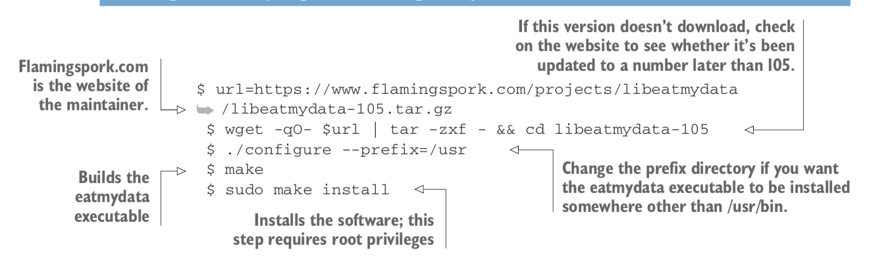
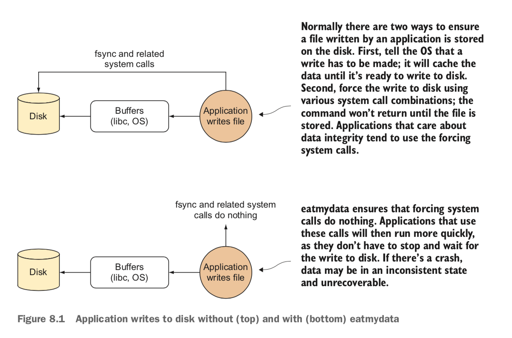

### - Technique 1 : Speeding up I/O-intensive builds with eatmydata

      + Because Docker is a great fit for automated building, you’ll likely perform a lot of disk-I/O-intensive
        builds as time goes on. Jenkins jobs, database rebuild scripts, and large code checkouts will all
        hit your disks hard. In these cases, you’ll be grateful for any speed increases you can get,
        both to save time and to minimize the many over- heads that result from resource contention.

        ++ This technique has been shown to give up to a 1:3 speed increase, and our experience backs this up.
           This is not to be sniffed at!

      + PROBLEM :
        You want to speed up your I/O-intensive builds.

      + SOLUTION :
        eatmydata is a program that takes your system calls to write data and makes them super-fast by bypassing work
        required to persist those changes. This entails some lack of safety, so it’s not recommended for normal use,
        but it’s quite useful for environ- ments not designed to persist, such as in testing.

      :INSTALLING EATMYDATA
       To install eatmydata in your container, you have a number of options:

       + If you’re running a deb-based distribution, you can apt-get install it.

       + If you’re running an rpm-based distribution, you’ll be able to rpm --install
         it by searching for it on the web and downloading it.
         Websites such as rpmfind.net are a good place to start.

       + As a last resort, and if you have a compiler installed, you can download and
        compile it directly as shown in the next listing.

       USING EATMYDATA
       Once libeatmydata is installed on your image (either from a package or from source),
       run the eatmydata wrapper script before any command, to take advantage of it:

       1- run this file -> /run_tests.sh
       2- docker run -d mdrahali/todo_app eatmydata-105 /run_tests.sh

       WARNING
       eatmydata skips the steps to guarantee that data is safely written to disk,
       so there’s a risk that data will not yet be on disk when the program thinks it is.
       For test runs, this usually doesn’t matter, because the data is dis- posable,
       but don’t use eatmydata to speed up any kind of environment where the data matters!

