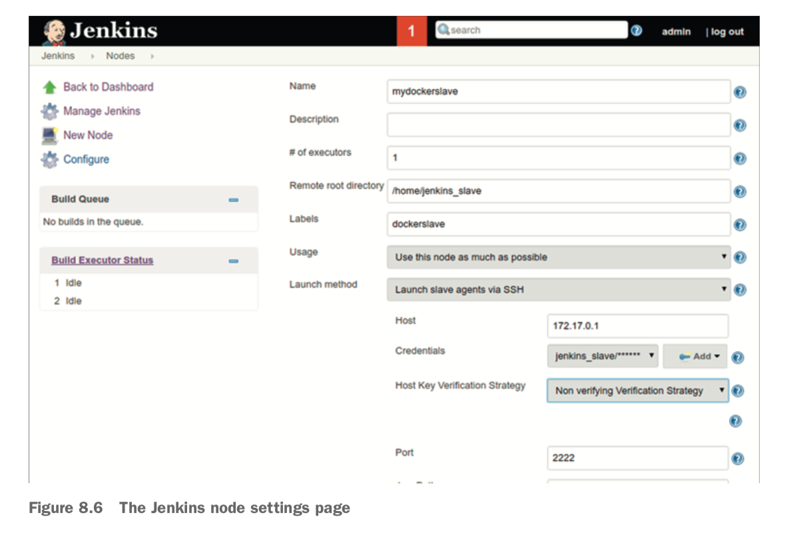

### - Jenkins CI :


### - Jenkins Server Master :


    No CMD or ENTRYPOINT instruction is given because we want to inherit the startup com- mand defined in the official Jenkins image.
    1- docker build -t jenkins:master .
    2- grep -w ^docker /etc/group

Run with:
```sh
docker run --name jenkins_server -p 8080:8080 -p 50000:50000 -v /var/run/docker.sock:/var/run/docker.sock -v /tmp:/var/jenkins_home -d jenkins_server
```

    + find password :
    1- docker exec jenkins_server cat /var/jenkins_home/secrets/initialAdminPassword


    If you access http://localhost:8080, you’ll see the Jenkins configuration interface— follow the process to your linking, probably using docker exec (described in tech- nique 12) to retrieve the password you’ll be prompted for at the first step.
    Once complete, your Jenkins server will be ready to go, with your plugins already installed (along with some others, depending on the options you selected during the setup process). To check this, go to Manage Jenkins > Manage Plugins > Installed,
    and look for Swarm to verify that it’s installed.

### - Jenkins Slave - Docker :

    + PROBLEM :
    You want to scale and modify your Jenkins slave.
    Stalemate has been known to ensue, because sysadmins may be reluctant to update their configuration management scripts
    for one group of people as they fear breaking another’s build, and teams get increasingly frustrated over the slowness
    of change. Docker (naturally) offers a solution by allowing multiple teams to use a base image for their own personal Jenkins slave,
    while using the same hardware as before. You can create an image with the required shared tooling on it, and allow teams to alter it to meet their own needs.
    Some contributors have uploaded their own reference slaves on the Docker Hub; you can find them by searching for “jenkins slave” on the Docker Hub.
    The following listing is a minimal Jenkins slave Dockerfile.

    + SOLUTION :
    Use Docker to encapsulate the configuration of your slave in a Docker image, and deploy.

    + NOTE :
    This technique has been constructed to show you the essentials of run- ning a Jenkins slave in a container.
    This makes the result less portable but the lesson easier to grasp. Once you understand all the techniques
    in this chapter, you’ll be able to make a more portable setup.


    - docker tag jenkins:master mdrahali/jenkins:master
    - docker push mdrahali/jenkins:master
    - docker tag jenkins:slave mdrahali/jenkins:slave
    - docker push mdrahali/jenkins:slave

    + prerequisite - run jenkins master :

    0- docker run --name jenkins_master -p 8080:8080 -p 50000:50000 mdrahali/jenkins:master

    1- docker build -t jenkins:slave .
    2- docker run --name jenkins_slave -ti -p 2222:22 jenkins:slave


    - Jenkins Home page :
    1- You can add a slave by clicking on Build Executor Status > New Node and adding the node name as a Permanent Agent,
       Call it mydockerslave.

    Click OK and configure it with these settings, as shown in figure 8.6:
    1- Set Remote Root Directory to /home/jenkins_slave.
    2- Give it a Label of “dockerslave”.
    3- Make sure the Launch Slave Agents Via SSH option is selected.
    4- Set the host to the route IP address seen from within the container (output with
    the docker run command earlier).
    5- Click Add to add credentials, and set the username to “jenkins_slave” and the
    password to “jpass”. Now select those credentials from the drop-down list.
    6- Set Host Key Verification Strategy to either Manually Trusted Key Verification Strategy, which will accept the SSH key on first connect, or Non Verifying Verifi-
    cation Strategy, which will perform no SSH host key checking.

    7- Click Advanced to expose the Port field, and set it to 2222.
    8- Click Save.
    9- Now click through to the new slave, and click Launch Slave Agent (assuming this doesn’t happen automatically).
       After a minute you should see that the slave agent is marked as online.


    10- Go back to the homepage by clicking on Jenkins at the top left, and click on New Item.
        Create a Freestyle Project called “test”, and under the Build section, click Add Build Step > Execute Shell,
        with the command echo done. Scroll up, and select `Restrict` Where Project Can Be Run and enter the Label Expression “dockerslave”. You should see that Slaves In Label is set as 1,
        meaning the job is now linked to the Docker slave. Click Save to create the job.




    Click Build Now, and then click the build “#1” link that appears below on the left.
    Then click Console Output, and you should see output like this in the main window:

    ```Started by user admin
    Building remotely on mydockerslave (dockerslave)
    ➥ in workspace /home/jenkins_slave/workspace/test [test] $ /bin/sh -xe /tmp/jenkins5620917016462917386.sh + echo done
    done
    Finished: SUCCESS ```

    Well done! You’ve successfully created your own Jenkins slave.

[jenkins-images-docker-hub](https://hub.docker.com/r/jenkins/jenkins/tags?page=1&ordering=last_updated)

### - Jenkins Slave - Docker ( Scaling your CI with Jenkins’ Swarm plugin ) :
    + PROBLEM :
    You want your CI compute to scale up with your development work rate.

    + SOLUTION :
    Use Jenkins’ Swarm plugin and a Docker Swarm slave to dynamically provision Jenkins slaves.

    Many small- to medium-sized businesses have a model for CI where one or more Jen- kins servers are devoted to supplying the resources required to run Jenkins jobs.
    This is illustrated in this figure.


    This works fine for a time, but as the CI processes become more embedded, capacity limits are often reached.
    Most Jenkins workloads are triggered by check-ins to source con- trol, so as more developers check in,
    the workload increases. The number of complaints to the ops team then explodes as busy developers impatiently wait
    for their build results.
    One neat solution is to have as many Jenkins slaves as there are people checking in code, as illustrated in figure 8.8.


    The Dockerfile shown in listing 8.13 creates an image with the Jenkins Swarm client plugin installed, allowing a Jenkins master
    with the appropriate Jenkins Swarm server plugin to connect and run jobs. It begins in the same way as the normal Jenkins
    slave Dockerfile in the last technique.

    + prerequisite - run jenkins master :

    0- docker run --name jenkins_master -p 8080:8080 -p 50000:50000 mdrahali/jenkins:master


    1- docker build -t jenkins:swarm .
    2- docker run -d --name jenkins_swarm_slave jenkins:swarm -username admin -password adminpassword


    Now that you have a slave set up on this machine, you can run Jenkins jobs on it. Set up a Jenkins job as normal, but add swarm as a label expression in the Restrict Where This Project Can Be Run section

### - Jenkins - Docker (Upgrades) :
    If you’ve used Jenkins for a while in production, you’ll be aware that Jenkins fre- quently publishes updates
    to its server for security and functionality changes.
    On a dedicated, non-dockerized host, this is generally managed for you through package management.
    With Docker, it can get slightly more complicated to reason about upgrades, as you’ve likely separated
    out the context of the server from its data.

    + PROBLEM :
    You want to reliably upgrade your Jenkins server.

    + SOLUTION :
    Run a Jenkins updater image that will handle the upgrade of a Jenkins server.
    This technique is delivered as a Docker image composed of a number of parts. First we’ll outline the Dockerfile that builds the image.
    This Dockerfile draws from the library Docker image (which contains a Docker client) and adds a script that man- ages the upgrade.
    The image is run in a Docker command that mounts the Docker items on the host, giving it the ability to manage any required Jenkins upgrade.


    The preceding script tries to pull jenkins from the Docker Hub with the docker pull command. If the output contains the phrase “up to date”, the docker pull | grep ... command returns true. But you only want to upgrade when you don’t see “up to date” in the output. This is why the if statement is negated with a ! sign after the if.
    The result is that the code in the if block is only fired if you downloaded a new version of the “latest” Jenkins image. Within this block, the running Jenkins container is stopped and renamed. You rename it rather than delete it in case the upgrade doesn’t work and you need to reinstate the previous version. Further to this rollback strategy, the mount folder on the host containing Jenkins’ state is also backed up.
    Finally, the latest-downloaded Jenkins image is started up using the docker run command.

    docker run --rm -d \
	-v /var/lib/docker:/var/lib/docker \
	-v /var/run/docker.sock:/var/run/docker.sock \
	-v /var/docker/mounts:/var/docker/mounts \
		mdrahali/jenkins_updater


    + CRONJOB To update jenkins each time :
    -> 0 * * * * docker run --rm -d -v /var/lib/docker:/var/lib/docker -v

