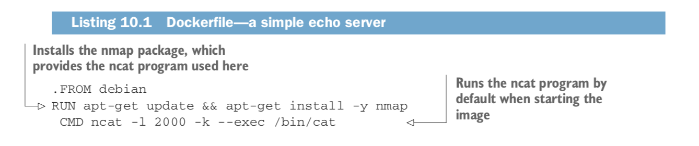

### Technique 1 :

    - PROBLEM :
    You want to coordinate connected containers on your host machine.

    - SOLUTION :
    Use Docker Compose, a tool for defining and running multicontainer Docker applications.
    The central idea is that rather than wiring up container startup commands with complex shell scripts or Makefiles, you declare the application’s startup configuration, and then bring the application up with a single, simple command.

    + Check version of docker compose:  docker-compose --version

    The -l 2000 arguments instruct ncat to listen on port 2000, and -k tells it to accept multiple client
    connections simultaneously and to continue running after clients close their connections so more clients can connect.
    The final arguments, --exec /bin/cat, will make ncat run /bin/cat for any incoming connections and forward any data coming
    over the connection to the running program.

    1- docker build -t server .
    2- docker build -t client .

    :TIP
    If you get an error when starting docker-compose that looks like “Couldn’t connect
    to Docker daemon at http+unix://var/run/docker.sock— is it running?”
    the issue may be that you need to run it with sudo.
