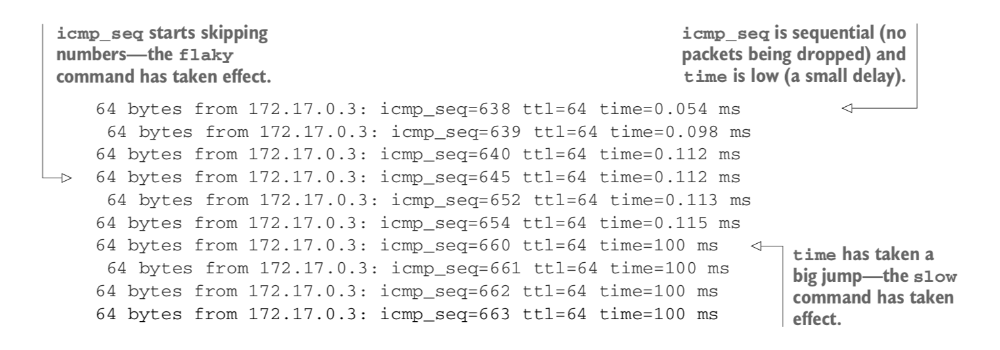

### Technique 1 :

    - PROBLEM :
    You want to coordinate connected containers on your host machine.

    - SOLUTION :
    Use Docker Compose, a tool for defining and running multicontainer Docker applications.
    The central idea is that rather than wiring up container startup commands with complex shell scripts or Makefiles, you declare the application’s startup configuration, and then bring the application up with a single, simple command.

    + Check version of docker compose:  docker-compose --version


    The -l 2000 arguments instruct ncat to listen on port 2000, and -k tells it to accept multiple client
    connections simultaneously and to continue running after clients close their connections so more clients can connect.
    The final arguments, --exec /bin/cat, will make ncat run /bin/cat for any incoming connections and forward any data coming
    over the connection to the running program.

    1- docker build -t server .
    2- docker build -t client .


    :TIP
    If you get an error when starting docker-compose that looks like “Couldn’t connect
    to Docker daemon at http+unix://var/run/docker.sock— is it running?”
    the issue may be that you need to run it with sudo.

### Technique 2 :

    SQLite doesn’t come with any concept of a TCP server by default. By building on previous techniques, this technique provides you with a means of achieving TCP server functionality using Docker Compose.
    Specifically, it builds on these previously covered tools and concepts:
    1- Volumes
    2- Proxying with socat
    3- Docker Compose


    PROBLEM
    You want to efficiently develop a complex application referencing external data on
    your host using Docker.
    SOLUTION

    At a high level there are two running Docker containers:
    + one responsible for executing SQLite clients,
    + and the other for proxying separate TCP connections to these clients.
      Note that the container executing SQLite isn’t exposed to the host;
      the proxy container achieves that. This kind of separation of responsibility into discrete units is a common feature of microservices architectures.


    It uses socat to create a sqlite server accessible on localhost:12346.


    The socat process in the server container will listen on port 12345 and permit mul- tiple connections,
    as specified by the TCP-L:12345,fork,reuseaddr argument. The part following EXEC: tells socat to run SQLite on the /opt/sqlite/db file
    for every connection, assigning a pseudo-terminal to the process. The socat process in the cli- ent container has the same listening behavior
    as the server container (except on a dif- ferent port), but instead of running something in response to an incoming connection,
    it will establish a TCP connection to the SQLite server.
    One notable difference from the previous technique is the use of networks rather than links—networks present a way to create new virtual networks inside Docker.
    Docker Compose will always use a new “bridge” virtual network by default; it’s just been named explicitly in the preceding Compose configuration.
    Because any new bridge network allows access to containers using their service names, there’s no need to use links (though you still can if you want aliases for services).

    run Docker compose Cluster:

    ```
    chmod +x setup_dbs.sh
    ./setup_dbs.sh
    [sudo] docker-compose up
    [rlwrap] telnet localhost 12346
    [rlwrap] telnet localhost 12346
    select * from t1;
    ```

    If you want to switch the server to live, you can change the configuration by changing
    the volumes line in docker-compose.yml from this,

    - /tmp/sqlitedbs/test:/opt/sqlite/db

    to this:

    - /tmp/sqlitedbs/live:/opt/sqlite/db

    Then rerun this command:
    $ docker-compose up

    WARNING
    Although we did some basic tests with this multiplexing of SQLite clients,
    we make no guarantees about the data integrity or performance of this server under any kind of load.
    The SQLite client wasn’t designed to work in this way. The purpose of this technique is to demonstrate the general
    approach of exposing a binary in this way.

    This technique demonstrates how Docker Compose can take something relatively tricky and complicated,
    and make it robust and straightforward. Here we’ve taken SQLite and given it extra server-like functionality
    by wiring up containers to proxy SQLite invocations to the data on the host. Managing the container complexity
    is made significantly easier with Docker Compose’s YAML configuration, which turns the tricky matter of orchestrating
    containers correctly from a manual, error-prone process to a safer, automated one that can be put under source control.

### Technique 3 - Simulating troublesome networks with Comcast :

    + PROBLEM :
    You want to be able to apply varying network conditions to individual containers.

    + SOLUTION :
    Use Comcast

    $ IMG=mdrahali/comcast
    $ docker pull $IMG
    $ alias comcast="docker run --rm --pid=host --privileged \
      -v /var/run/docker.sock:/var/run/docker.sock $IMG"
    $ comcast -help

    $ docker run -it --name c1 ubuntu:14.04.2 bash
    $ root@99267a5c48e4:/# apt-get update && apt-get install -y wget
    $ root@99267a5c48e4:/# ping -q -c 5 www.example.com
    $ root@99267a5c48e4:/# time wget -o /dev/null https://www.example.com

    + Once you’ve done this, leave the container running and
    you can apply some network conditions to it:

    $ docker build -t docker-comcast .
    $ comcast -cont c1 -default-bw 50 -latency 100 -packet-loss 20%


    -> The preceding command applies three different conditions:
       50 KBps bandwidth cap for all destinations (to bring back memories of dial-up),
       an added latency of 100 ms (on top of any inherent delay),
       and a packet loss percentage of 20%.

    -> Comcast first identifies the appropriate virtual network interface for the container and then invokes
       a number of standard Linux command-line networking utilities to apply the traffic rules,
       listing what it’s doing as it goes along.
       Let’s see how our con- tainer reacts to this:

        root@99267a5c48e4:/# ping -q -c 5 www.example.com
        PING www.example.com (93.184.216.34) 56(84) bytes of data.

        --- www.example.com ping statistics ---
        5 packets transmitted, 4 received, 20% packet loss, time 4060ms
        rtt min/avg/max/mdev = 220.955/310.946/494.679/107.620 ms

        !SUCCESS

     Success! An additional 100 ms of latency is reported by ping,
     and the timing from wget shows a slightly greater than 5x slowdown,
     approximately as expected (the bandwidth cap, latency addition,
     and packet loss will all impact on this time). But there’s some- thing
     odd about the packet loss—it seems to be three times greater than expected.
     It’s important to bear in mind that the ping is sending a few packets,
     and that packet loss isn’t a precise “one in five”
     counter—if you increase the ping count to 50,
     you’ll find that the resulting loss is much closer to what’s expected.


     ++ You need to remove the rules if you want to get your normal container network operation back.

     - Don’t worry about removing them if you exit the container, though—they’ll be auto-
       matically deleted when Docker deletes the virtual network interface.

     $ comcast -cont c1 -stop

### Technique 4 - Simulating troublesome networks with Blockade

    On the subject of simulating a network with many machines, there’s a particular kind of network failure that becomes
    interesting at this scale—a network partition. This is when a group of networked machines splits into two or more parts,
    such that all machines in the same part can talk to each other, but different parts can’t commu- nicate.
    Research indicates that this happens more than you might think, particularly on consumer-grade clouds!
    Going down the classic Docker microservices route brings these problems into sharp relief,
    and having the tools to do experiments is crucial for understanding how your service will deal with it.

    PROBLEM
    You want to orchestrate setting network conditions for large numbers of containers,
    including creating network partitions.

    SOLUTION
    Use Blockade (https://github.com/worstcase/blockade)—an open source piece of software originally from a team at Dell,
    created for “testing network failures and partitions.

    + Blockade works by reading a configuration file (blockade.yml) in your current directory
      that defines how to start containers and what conditions to apply to them. In order to apply conditions,
      it may download other images with required utilities installed. The full configuration details
      are available in the Blockade documentation

    + Blockade is a utility for testing network failures and partitions in distributed applications.
      Blockade uses Docker containers to run application processes and manages
      the network from the host system to create various failure scenarios.

    + blockade.yml :
     The sleep 5 commands are to make sure the server is running before starting the clients.

    $ cd network-failure
    $ IMG=mdrahali/blockade
    $ docker pull $IMG

    $ alias blockade="docker run --rm -v \$PWD:/blockade \
      -v /var/run/docker.sock:/var/run/docker.sock $IMG"

    $ blockade up

    $ docker logs -f e8188fc6a99d # see waht happen in given container




    + so let’s take a look at the killer feature of Blockade — network partitions:

    $ blockade partition server client1,client2
    $ blockade status

    -> This has put our three nodes in two boxes
       1- the server in one
       2- and clients in the other

       #with no way of communicating between them.

       You’ll see that the log for client1 has stopped doing anything
       because all of the ping packets are being lost.

    $ docker logs -f e8188fc6a99d

    - The clients can still talk to each other, though, and you can verify this
      by sending a few ping packets between them:

    $ docker exec e8188fc6a99d ping -qc 3 172.19.0.4

    + pinging IP address of container to know if it's on the same network with you or not.

    for example after partitions there is no bridge between client1 and server
    result: 3 packets transmitted, 0 received, 100% packet loss, time 2048ms


### Technique 4 - Creating another Docker virtual network

    $ docker network ls
    $ docker network create --driver=bridge mynet
    $ docker network ls | grep mynet
    $ ifconfig | grep br-
    $ ifconfig | grep docker

    #Start two container on `mynet` network
    $ docker rm --force c1
    $ docker run -it -d --name c1 ubuntu:14.04.2 bash
    $ docker network connect mynet c1 # {default, mynet}
    $ docker run -it -d --name c2 \
      --net=mynet ubuntu:14.04.2 bash # {mynet} is created inside mynet
    $ docker run -it -d --name c3 ubuntu:14.04.2 bash {default} have just by default bridge

    $ docker exec c1 ip addr | grep 'inet.*eth'
          inet 172.17.0.3/16 brd 172.17.255.255 scope global eth0 # default bridge
          inet 172.20.0.3/16 brd 172.20.255.255 scope global eth1 # mynet bridge

    $ docker exec c2 ip addr | grep 'inet.*eth'
          inet 172.20.0.2/16 brd 172.20.255.255 scope global eth0

    $ docker exec c3 ip addr | grep 'inet.*eth'
         inet 172.17.0.2/16 brd 172.17.255.255 scope global eth0

    $ docker exec c2 ping -qc1 c1 # bing c1 from c2 (both linked to mynet bridge)
    $ docker exec c2 ping -qc1 c3
    $ docker exec c1 ping -qc1 c2
    $ docker exec c1 ping -qc1 c3
    $ docker exec c1 ping -qc1 172.17.0.3

    On the new bridge, containers can ping each other with IP address and name.
    + On the default bridge, containers can only ping each other by IP address.

### Technique 5 - Setting up a substrate network with Weave
