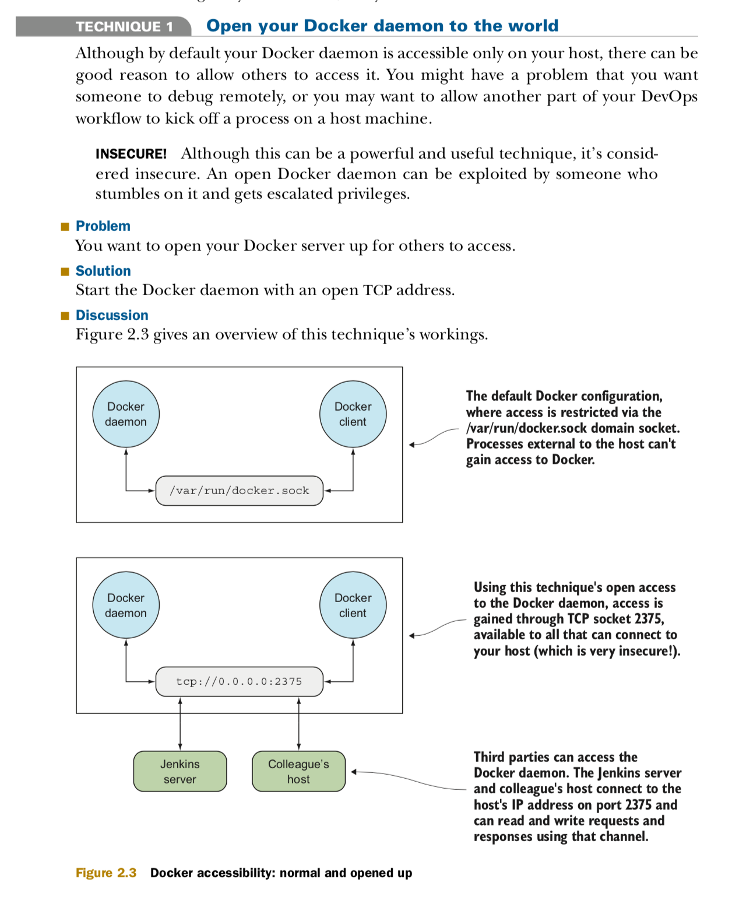

### - Open Docker Daemon to the world (Insecure) :

- [install pycharm on linux](https://medium.com/@singh.shreya8/how-to-install-pycharm-in-ubuntu-16-04-ubuntu-14-04-ubuntu-18-04-linux-easiest-way-5ae19d052693)
### - Steps (on linux):
    1- Before you open up the Docker daemon, you must first shut the running one down.
       How you do this will vary depending on your operating system.
       If you’re not sure how to do this, you can first try this command.

       - sudo su - (connect as root user)
       - service docker stop
       or systemctl stop docker
       - ps -ef | grep -E 'docker (-d|daemon)\b' | grep -v grep
       - dockerd -H tcp://0.0.0.0:2375
       - service docker start (disable open access to daemon and start docker locally)
    + This command starts docker as a daemon (dockerdaemon), defines the host server with the -H flag,
      uses the TCP protocol, opens up to all IP addresses (with 0.0.0.0), and opens on the standard Docker server port (2375).

    :USE IP RESTRICTIONS If you open your daemon up, be sure to open up to a specific IP range only, and not to 0.0.0.0, which is highly insecure!
