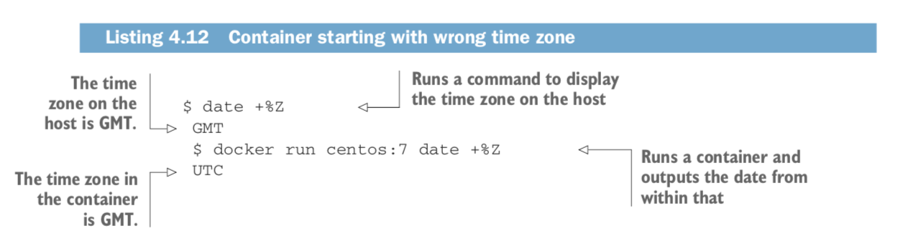
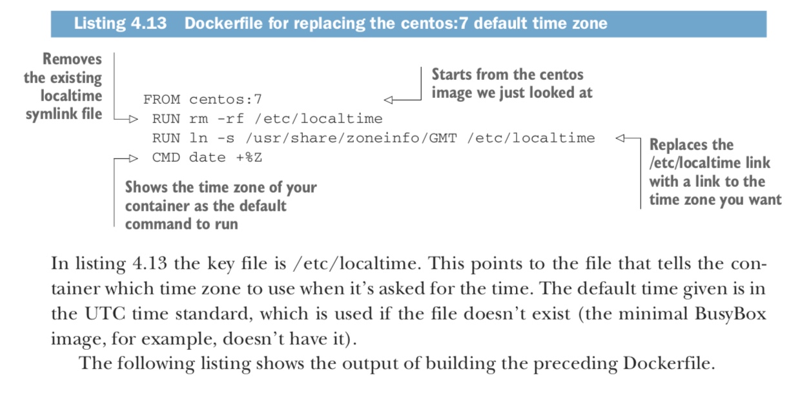
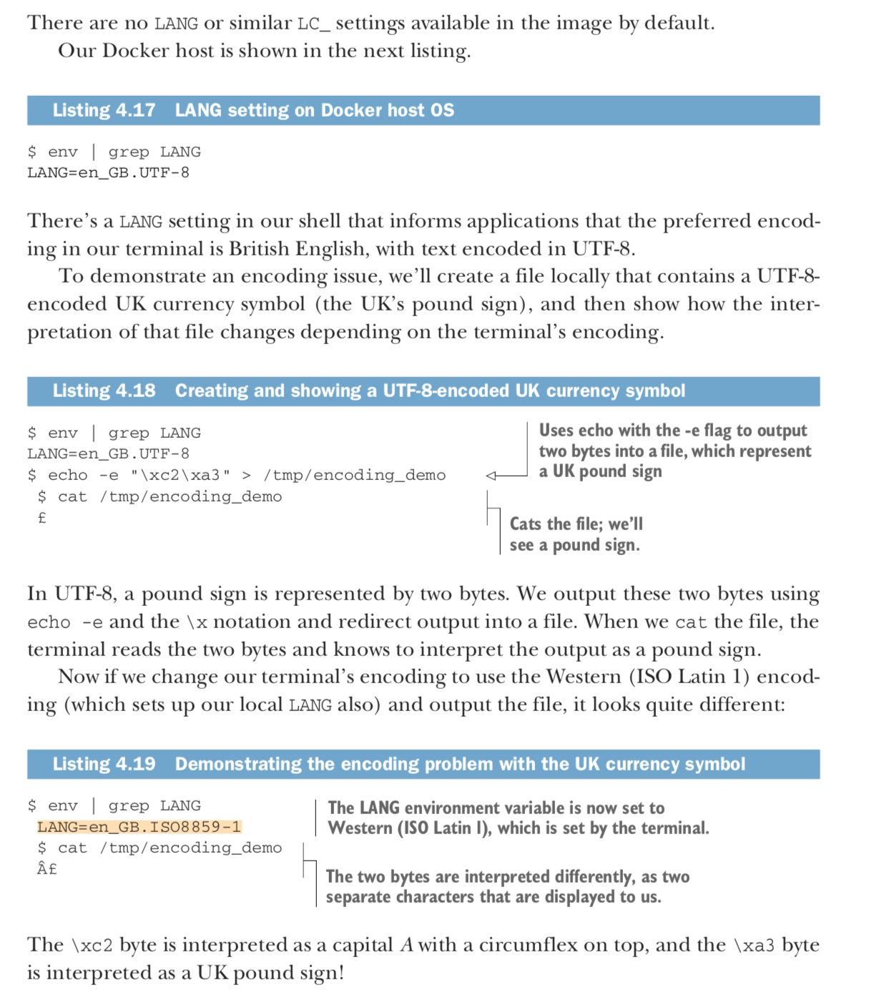
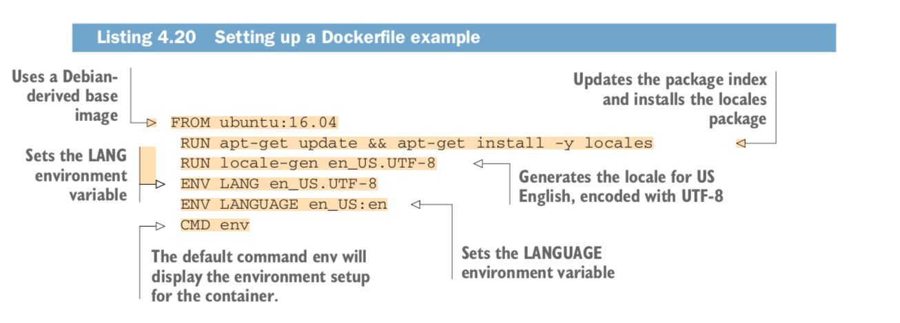

### - Technique 1:

    :Setting the right time zone in your containers
    PROBLEM
    You want to set the time zone correctly for your containers.

    SOLUTION
    Replace the container’s localtime file with a link to the time zone you want.
    The following listing demonstrates the problem. It doesn’t matter where in the
    world you run this, the container will show the same time zone.

    1- docker run mysql date +%Z (default timezone)
    2- Dockerfile
    3- docker build -t timezone_change .

    There’s another problem that this container-level time granularity can solve.
    If you’re working for a multinational organization and run many different applications
    on servers based in data centers around the world, the ability to change the time zone
    in your image and trust that it will report the right time wherever it lands is a useful
    trick to have to hand.

### - Technique 2:
    NOTE :
    A locale defines which language and country settings your programs should use.
    Typically a locale will be set in the environment through the LANG, LANGUAGE,
    and locale-gen variables, and through variables beginning with LC_, such as LC_TIME,
    whose setting determines how the time is displayed to the user.

    + PROBLEM :
    You’re seeing encoding errors in your application builds or deployments.

    + SOLUTION :
    Ensure the langugage-specific environment variables are correctly set in your Dockerfile. Encoding issues aren’t always obvious to all users, but they can be fatal when build-
    ing applications.

    `TIP`
    A non-exhaustive list of key words to look out for in the error are “encod- ing,”
    “ascii,” “unicode,” “UTF-8,” “character,” and “codec.” If you see these words,
    chances are you’re dealing with an encoding issue.

    1- docker run -ti ubuntu bash
    2- env
    3- env | grep LANG

    There are no LANG or similar LC_ settings available in the image by default.
    Our Docker host is shown in the next listing.

    4- export LANG=en_GB.UTF-8
    5- echo -e "\xc2\xa3" > /tmp/encoding_demo (create a file where pound currency is printed -> en_GB.UTF-8 (UK based on timezone))
    6- cat /tmp/encoding_demo

    Illustration :

    Example of defining lang in a dockerfile :

