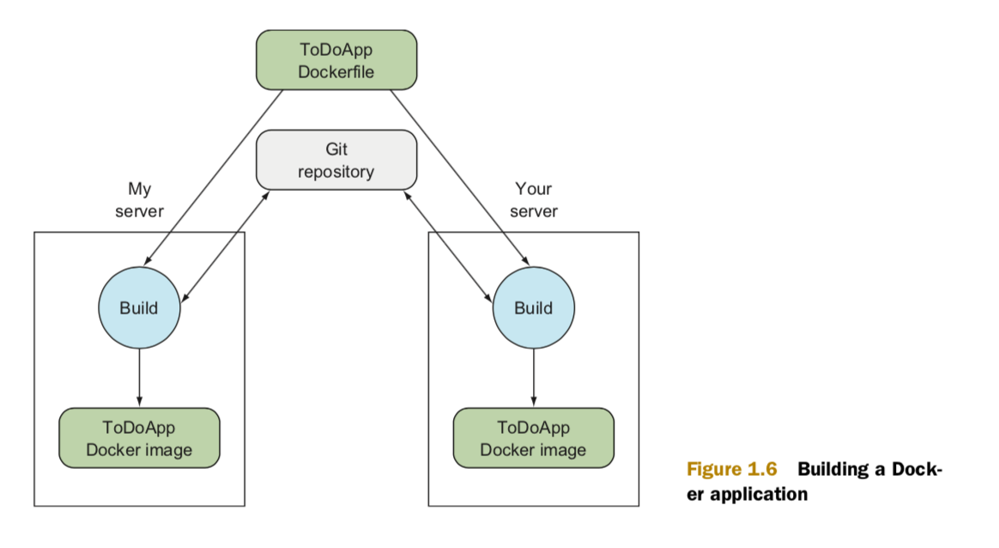
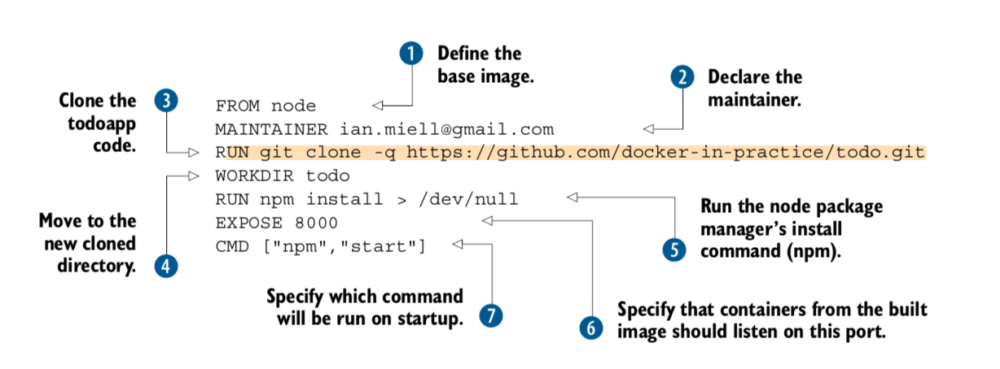
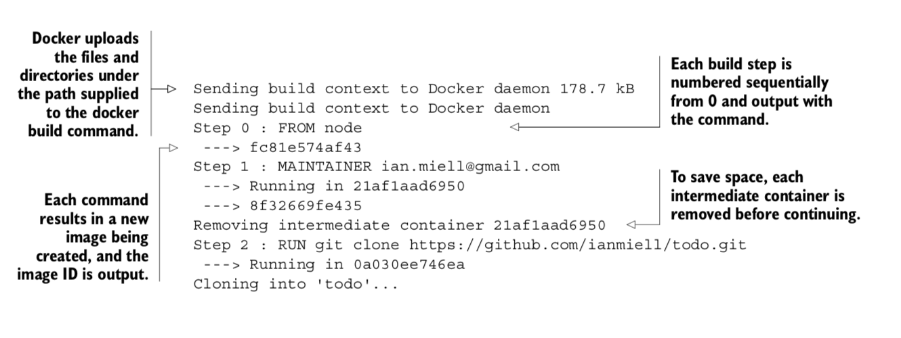
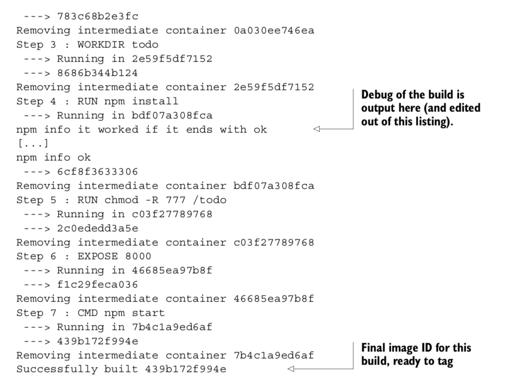
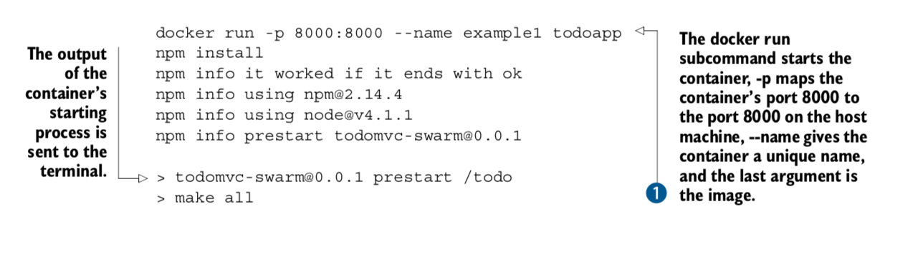
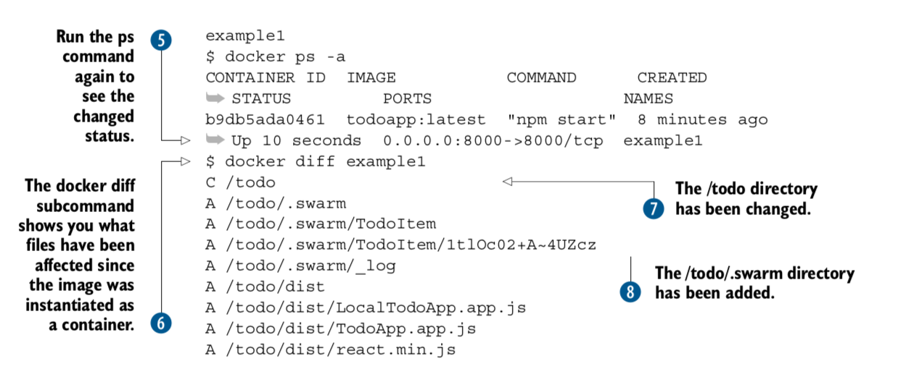

#### - Docker Continuous Delivery pipeline :

#### - Docker made simple (Writing a Dockerfile for node.js app):

    + You begin the Dockerfile by defining the base image with the FROM command.
      This example uses a Node.js image so you have access to the Node.js binaries.
      The official Node.js image is called node.

    + Next, you declare the maintainer with the MAINTAINER command.
      In this case, we’re using one of our email addresses,
      but you can replace this with your own

    + reference because it’s your Dockerfile now. This line isn’t required
      to make a working Docker image, but it’s good practice to include one.
      At this point, the build has inherited the state of the node container,
      and you’re ready to work on top of it.

    + Next, you clone the todoapp code with a RUN command. This uses the specified command
      to retrieve the code for the application, running git within the container.
      Git is installed inside the base node image in this case,
      but you can’t take this kind of thing for granted.

    + Now you move to the new cloned directory with a WORKDIR command. Not only does this change
      directory within the build context, but the last WORKDIR command determines
      which directory you’re in by default when you start up your container from your built image.

    + Next, you run the node package manager’s install command (npm). This will set up the dependencies
      for your application. You aren’t interested in the output here, so you redirect it to /dev/null.

    + Because port 8000 is used by the application, you use the EXPOSE command to tell Docker
      that containers from the built image should listen on this port.

    + Finally, you use the CMD command to tell Docker which command will be run on startup of the container.

#### - Steps to run Dockerfile:

    + docker build . ( `.` means the path to Dockerfile [in our case teh same directory])
    + docker tag 66c76cea05bb todoapp (Tagging docker image)
    + docker run -p 8000:8000 --name example1 todoapp
    + docker ps -a (After canceling)
    + docker start example1 (restart docker container in the background)
    + docker diff example1 (shows the files that has been affected in the instantiation)
      A /todo/dist/react.min.js (react.min.js has been added)
      C /root (/root directory has been changed)

