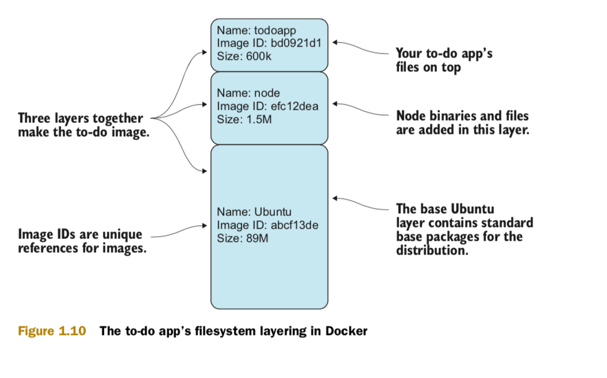
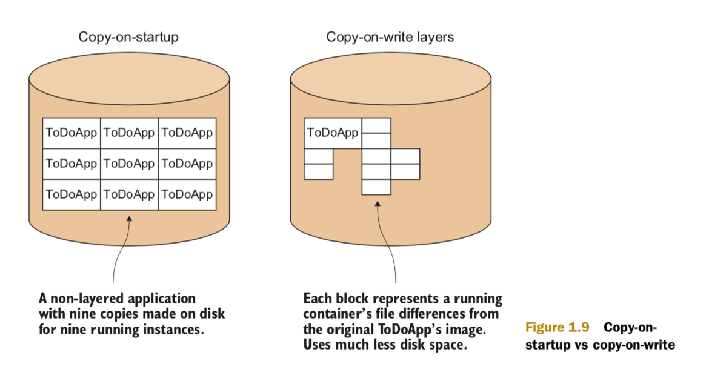

#### - Docker Continuous Delivery pipeline :

#### - Docker made simple (Writing a Dockerfile for node.js app):

    + You begin the Dockerfile by defining the base image with the FROM command.
      This example uses a Node.js image so you have access to the Node.js binaries.
      The official Node.js image is called node.

    + Next, you declare the maintainer with the MAINTAINER command.
      In this case, we’re using one of our email addresses,
      but you can replace this with your own

    + reference because it’s your Dockerfile now. This line isn’t required
      to make a working Docker image, but it’s good practice to include one.
      At this point, the build has inherited the state of the node container,
      and you’re ready to work on top of it.

    + Next, you clone the todoapp code with a RUN command. This uses the specified command
      to retrieve the code for the application, running git within the container.
      Git is installed inside the base node image in this case,
      but you can’t take this kind of thing for granted.

    + Now you move to the new cloned directory with a WORKDIR command. Not only does this change
      directory within the build context, but the last WORKDIR command determines
      which directory you’re in by default when you start up your container from your built image.

    + Next, you run the node package manager’s install command (npm). This will set up the dependencies
      for your application. You aren’t interested in the output here, so you redirect it to /dev/null.

    + Because port 8000 is used by the application, you use the EXPOSE command to tell Docker
      that containers from the built image should listen on this port.

    + Finally, you use the CMD command to tell Docker which command will be run on startup of the container.

#### - Steps to run Dockerfile:

    + docker build . ( `.` means the path to Dockerfile [in our case teh same directory])
    + docker tag 66c76cea05bb todoapp (Tagging docker image)
    + docker run -p 8000:8000 --name example1 todoapp
    + docker ps -a (After canceling)
    + docker start example1 (restart docker container in the background)
    + docker diff example1 (shows the files that has been affected in the instantiation)
      A /todo/dist/react.min.js (react.min.js has been added)
      C /root (/root directory has been changed)

#### - Docker layering

    + Docker layering helps you manage a big problem that arises when you use containers
      at scale. Imagine what would happen if you started up hundreds—or even thousands—of
      the to-do app, and each of those required a copy of the files to be stored somewhere.

    + As you can imagine, disk space would run out pretty quickly! By default,
      Docker internally uses a copy-on-write mechanism to reduce the amount of disk space required

#### - Docker Copy-on-write

     Whenever a running container needs to write to a file, it records the change by copying
     the item to a new area of disk. When a Docker commit is performed, this new area of disk
     is frozen and recorded as a layer with its own identifier.
     This partly explains how Docker containers can start up so quickly—they have nothing
     to copy because all the data has already been stored as the image.

     #COPY-ON-WRITE Copy-on-write is a standard optimization strategy used in com- puting.
     When you create a new object (of any type) from a template, rather than copying
     the entire set of data required, you only copy data over when it’s changed.
     Depending on the use case, this can save considerable resources.

    Because the layers are static, you only need build on top of the image you wish to take as a reference,
    should you need anything to change in a higher layer. In the to-do app, you built from the publicly available
    node image and layered changes on top.
    All three layers can be shared across multiple running containers, much as a shared library can be shared
    in memory across multiple running processes. This is a vital feature for operations, allowing the running
    of numerous containers based on different images on host machines without running out of disk space.
    Imagine that you’re running the to-do app as a live service for paying customers.
    You can scale up your offering to a large number of users. If you’re developing,
    you can spin up many different environments on your local machine at once.
    If you’re moving through tests, you can run many more tests simultaneously, and far more quickly than before.
    All these things are made possible by layering.
    By building and running an application with Docker, you’ve begun to see the power that Docker can bring
    to your workflow. Reproducing and sharing specific envi- ronments and being able to land these in various
    places gives you both flexibility and control over development.
